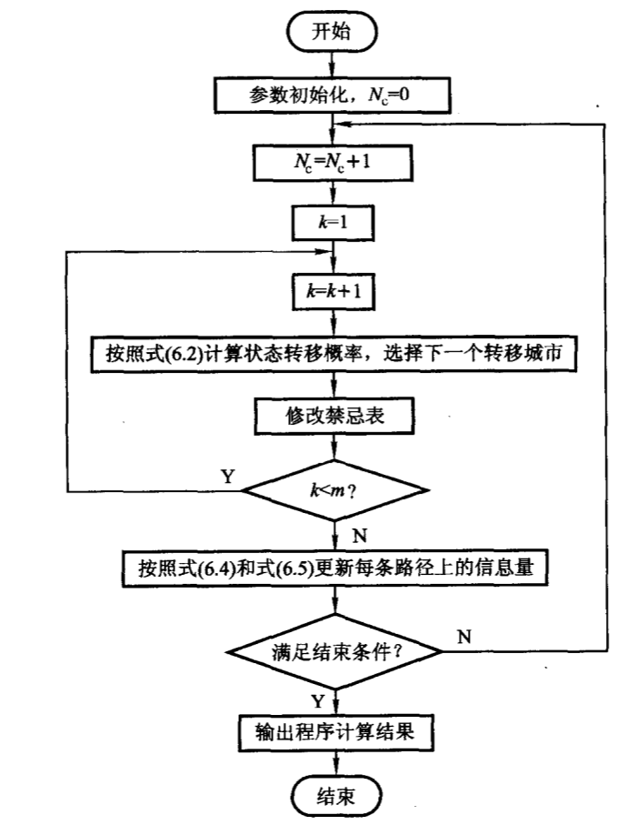
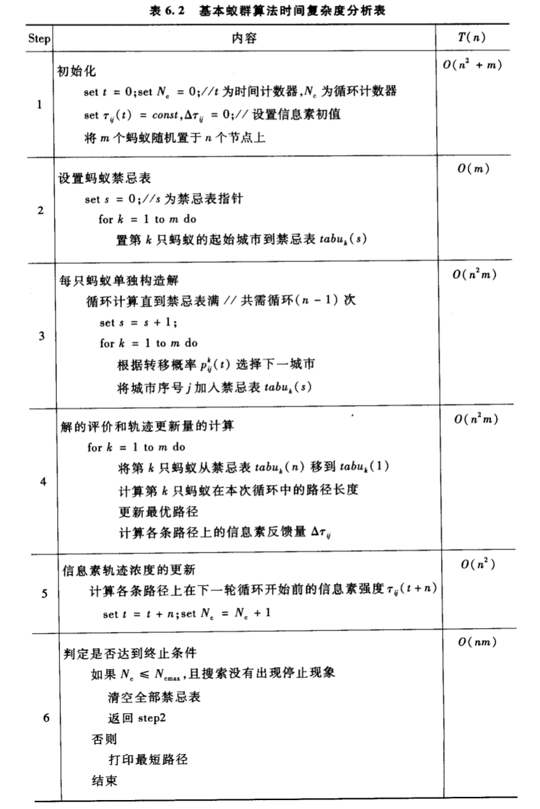

## 蚁群算法

​	蚁群算法与传统的数学规划算法完全不同，是一种基于仿生学的优化算法。生物学家发现昆虫群落在一级上的合作基本上是自组织的，许多场合中尽管这些合作很简单，但它们可以解决很多复杂的问题。

​	蚁群算法是模拟蚂蚁群体觅食行为的仿生学优化算法（Ant Colony Algorithm, ACA）。该算法引入**正反馈并行机制**（增强型学习系统），具有较强的鲁棒性、有两的分布式计算机制、易于与其他方法相结合等优点。蚁群算法解决了许多复杂优化和经典NP- C问题。

### 蚂蚁群体的觅食特性

​	蚂蚁会分泌一种信息素（Pheromone），蚂蚁的许多行为会受到信息素的调控，蚂蚁在运动的过程中，能够在其经过的路上留下信息素，并且能感知此种物质的存在，以此制导自己的运动方向。蚂蚁倾向于朝着**信息素浓度高**的方向移动。

### 人工蚂蚁与真实蚂蚁的异同

**相同点：**

- 两个群体都存在个体相互交流的通信机制，真实蚂蚁在经过的路径上留下信息素；人工蚂蚁改变其所经过的路径上存储的数字化信息素，该信息素记录了人工蚂蚁当前解和历史解的性能状态，并且可以被后继人工蚂蚁读写。
- 信息素可以挥发，从而被逐渐忘却
- 都要完成最短路径的任务，两种蚂蚁都只能在相邻节点间运动，直到遍历完成所有节点
- 都采用根据当前信息进行路径选择的随机选择策略；都利用了概率选择策略实现（根据当前信息来预测未来情况）

**不同点：**

- 人工蚂蚁具有记忆力，从而可以记住曾经走过的路径或访问过的节点，提高算法效率；真实蚂蚁并没有
- 人工蚂蚁选择路径的时候并不是盲目的，受到了问题空间的特征的启发，按照一定的算法规律有意识地寻找最短路径
- 人工蚂蚁生活在离散时间环境，即问题的求解规划空间是离散的，而真实蚂蚁生活在连续时间环境中

### 基本蚁群算法

以TSP问题具体分析：n个城市间的距离为$d_{ij}$

#### 基本蚁群算法的数学模型

- $\eta$：启发式因子

- $\tau$：信息素强度

- 概率选择公式：
  $$
  P_{ij}^k = \left\{
  \begin{array}{l}
  \frac{[\tau_{ij}(t)]^\alpha\cdot[\eta_{ij}]^\beta}{\sum_{l\in A_k}[\tau_{ij}]^\alpha\cdot[\eta_{il}]^\beta} & j\in A\\
  0 & others
  \end{array}
  \right.
  $$

- $A_k = N/\text{tabu}_k(t)$ 表示蚂蚁k走过的城市

- $\text{tabu}_k(t)$表示蚂蚁k走过的城市

- $\alpha,\beta$：指数权重：

  - $\alpha = 0,\beta = 1$：贪婪启发式
  - $\alpha = 1, \beta = 0$：只考虑信息素

- 信息素强度的计算：$\tau_{ij}(t+n) = \rho\tau_{ij}(t)+\Delta\tau_{ij}$， $\Delta\tau_{ij} = \sum_{k = 1}^M\Delta\tau_{ij}^k$，$\rho$：遗忘因子

- $$
  \Delta\tau_{ij}^k = \left\{
  \begin{array}{l}
  &	\frac{Q}{L_k}\quad\quad\text{edge ij}\in \text{k-th tour}\\
  	&0 \quad\quad\text{others}
  \end{array}
  \right.
  $$

- $Q$：常量

- $L_k$：k-th tour 路径长

#### 蚁群算法的具体实现

$N_c$ : 巡迹次数 

### AS模型的建立

​	ACO中人工蚂蚁实际上是一个随机构建过程，在构建过程中通过不断向部分解添加符合定义的解成分从而构建出一个完整的解。因此ACO元启发式算法可以应用到任何能够定义构建性启发式的组合优化问题中。

​	考虑一个最小化问题$(S,f,\Omega)$，对每个候选解$s\in S$，有$f(s,t)$为目标函数值，$\Omega(t)$ 是约束条件的集合，参数$t$ 表明目标函数和问题的约束都与时间$t$有关。问题的目标是要找到一个全局最优可行解$s*$。给定上述问题的描述，人工蚂蚁就可以在完全连接图$G_c=(C,L)$上通过随机游走来构建解，其中图上的点是$C$中的成分，集合$L$完全连接中$C$的成分点。图$G_c$称为构建图，$L$中的元素称为连接，问题的约束$\Omega(t)$包含在人工蚂蚁遵循的策略中。

#### 蚁群算法的复杂度分析

### 离散域蚁群算法的改进研究

#### 蚁群系统

ACS解决了基本蚁群算法在构造解的过程中，随机选择策略造成的算法进化速度慢的缺点，该算法在每一次循环中仅让最短路径上的信息量作更新，且以较大的概率让信息量最大的路径被选中。ACS的核心思想是：蚂蚁在寻找最佳路径的过程中，只能使用局部信息，即采用局部信息路径上的信息量进行调整；在进行寻优的蚂蚁结束路径的搜索后，路径上的信息量会再一次调整，这次采用的是全局信息，而且只对过程中发现的最好路径上的信息量进行加强。

与传统蚁群算法三点不同：

- 蚂蚁的状态转移规则
- 全局更新规则不同
- 新增了对各条路径信息量调整的局部更新规则

##### ACS状态转移规则

​	为了避免停滞现象的出现，ACS采用了**确定性选择和随机性选择相结合**， 并在搜索过程中动态调整状态转移概率，即对于位于城市$i$的蚂蚁$k$，按照下述规则选择城市：
$$ {eq1}
j = \left\{
\begin{array}{l}
 &\text{arg} \mathop{\max}_\limits{s
\in J_k(i)}\{[\tau(i,s)]^\alpha[\eta(i,s)]^\beta\} & q\le q_0\\
 &p_{ij}^k &others
\end{array}
\right.
$$

$$
p_{ij}^k = \left\{
\begin{array}{l}
\frac{[\tau(i,j)]^\alpha\cdot[\eta(i,j)]^\beta}{\sum_{s\in J_k(i)}[\tau(i,s)]^\alpha\cdot[\eta(i,s)]^\beta} & j\in allowed_k\\
0 & others
\end{array}
\right.
$$

​	其中$J_k(i)$ 是第$k$只蚂蚁在访问城市$i$后还需访问的城市集合，$q$ 为一个区间$[0,1]$内的随机数，$q_0$ 是一个算法参数。

​	公式1给出的转移策略称为**伪随机概率选择规则**	

##### 全局更新规则

​	ACS中，全局更新不再适用于全部的蚂蚁，而是只对每次循环中最优的蚂蚁使用：
$$
\tau(i,j)\leftarrow(1-\rho)\cdot\tau(i,j)+\rho\cdot\Delta\tau(i,j)
$$
其中
$$
\Delta\tau(i,j) = 
\left\{
\begin{array}{l}
1/L_{gb} &(i,j) \text{ is global best-path }\&\&\,L_{gb} \text{ is the shortest-path}\\
0 & other
\end{array}
\right.
$$
$\rho$ 为一个$(0,1)$区间的参数，意义相当于蚁群算法基本模型中路径上的信息素挥发系数。

##### 局部更新规则

​	局部更新规则是在所有的蚂蚁完成一次转移后执行公式3更新规则，其中$\Delta\tau(i,j)$有多种不同的选择方案：

1. $\Delta\tau(i,j) = 0$
2. $\Delta\tau(i,j) = \tau_0$，$\tau_0$为路径上信息素的初始值
3. $\Delta\tau(i,j) = \gamma\cdot\mathop{\max}_\limits{z\in J_k(j)}\tau(i,j)$

 使用第三种方案的ACS算法被称之为Ant- Q强化学习的蚁群算法，更加利于全局搜索

#### 最大-最小蚁群系统	

​	研究表明，将蚂蚁的搜索行为集中到最优解附近可以提高解的质量和收敛速度，从而改进算法的性能。但是这种搜索方法会使得算法过早收敛而出现早熟现象，MMAS的出现就是为了解决这个问题。		

​	MMAS的基本思想：仅仅让每一代中最好的个体所走路径上的信息量作调整，从而更好地利用了历史信息，加快收敛速度。为了避免算法过早收敛于非全局最优解，将各个路径上的信息量限制在$[\tau_{\min}, \tau_{\max}]$之内，这样可以有效避免某条路径上的信息量远远大于其他路径而造成所有蚂蚁都集中到同一条路径上，导致算法不再扩散。该算法是解决TSP问题等离散优化问题最好的蚁群算法之一。

​	与传统蚁群算法相比，MMAS蚁群算法有三点改进：

- 初始化信息量$\tau_{ij}(t) = c$，设置为最大值 $\tau_{\max}$

- 各个蚂蚁在一次循环后，只有找到最短路径的蚂蚁才能在其经过的路径上释放信息素，即
  $$
  \tau_{ij}(t+n) = (1-\rho)\cdot\tau_{ij}(t)+\Delta\tau_{ij}^{\min} 
  \\\Delta\tau_{ij}^{\min} = Q/L ,\;L= \min(L_k),\,k = 1,2,\cdots,m
  $$

- 最后将$\tau_{ij}(t)$ 限定在$[\tau_{\min}, \tau_{\max}]$之间，如果$\tau_{ij}(t)<\tau_{\min}$，则$\tau_{ij}(t) = \tau_{\min}$；如果$\tau_{ij}(t)>\tau_{\max}$， 则$\tau_{ij}(t) = \tau_{\max}$

