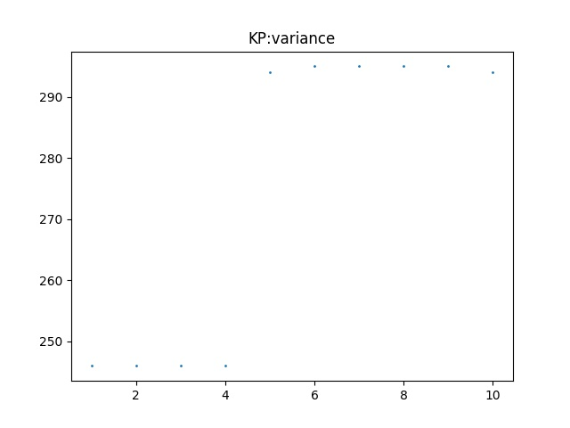
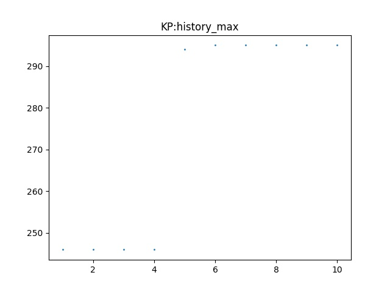
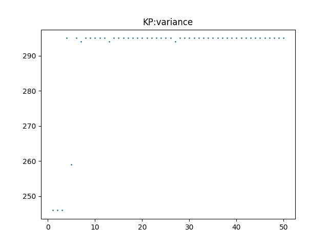
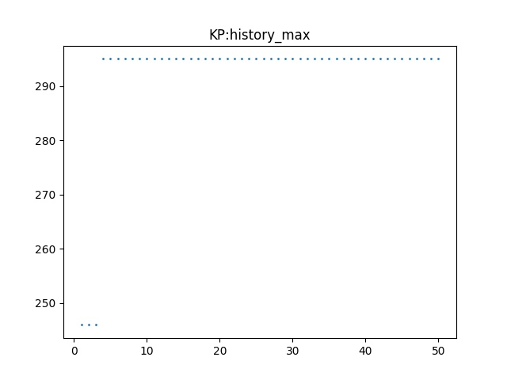
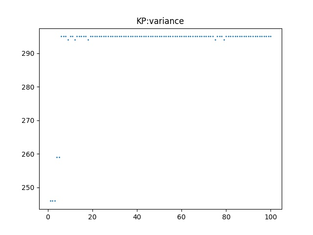
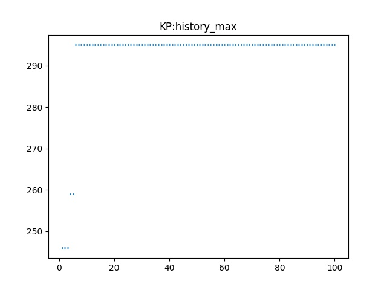
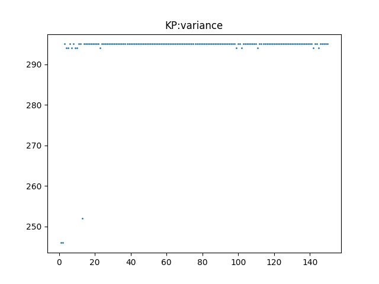
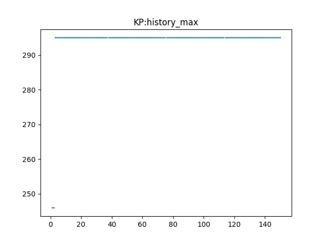

## 使用蚁群算法解决0-1背包问题

- 算法流程

  1. 初始化，NC=0，$\tau_{ij} =c (= 1)$，初始化蚂蚁的开始城市（随机）

  2. 蚂蚁开始行动，对于背包问题，停止条件为装不下（任意一个物品加入导致超重），其中物品的加入按照$p_{ij}^k$的概率更新，$i$分别为在背包中的最后一件物品，$j$为即将加入的物品，$k$为第$k$个蚂蚁，行动后，蚂蚁将信息素更新在一个临时的表上，其中
     $$
     p_{ij}^k = \left\{
     \begin{array}{l}
     \frac{[\tau(i,j)]^\alpha\cdot[\eta(i,j)]^\beta}{\sum_{s\in J_k(i)}[\tau(i,s)]^\alpha\cdot[\eta(i,s)]^\beta} & j\in allowed_k\\
     0 & others
     \end{array}
     \right.
     $$
     本实验采用了均匀概率选择方法（轮盘赌，赌盘面积与概率正比）

     蚂蚁的信息素更新
     $$
     \Delta\tau_{ij}^k = Q/L_k, \;\text{for } (i,j)\in \text{path}
     \\
     L_k = \text{total value} = \sum_{j \in \text{tabu}_k(t)}\text{value}(j)
     $$

  3. 更新用刚才的临时表更新$\tau$，$\tau_{ij}  = \rho\tau_{ij}+\Delta \tau_{ij},\;NC=NC+1$，未到迭代步则转步骤2

  4. 迭代直到NC到达预定值

- 代码

  - 参数设置

   ```python
       def __init__(self, clength, NC, m, max_content, rho, alpha, beta, Q):
           self.global_random_list_index = 1
           self.random_list_length = 2 ** 20
           self.random_list = []
           self.start_time = time.time()
           self.end_time = self.start_time
           self.file_path = '/Users/birdpeople/classObject/'
   
           self.m = m
           self.statistics = []
           self.node_num = clength
           self.max_content = max_content #max package content
           self.tabu = [[]for i in range(self.m)]
           self.tau = [[1 for i in range(self.m)]for j in range(self.m)]
           self.eta = [[[] for i in range(self.m)] for j in range(self.m)]
           self.tau_m = [[0 for i in range(self.m)]for j in range(self.m)]
           self.close_pos = [[]for i in range(self.m)]
           self.fitness = 0
           self.fitness_code = []
           self.result = []
           self.rho = rho
           self.alpha = alpha
           self.beta = beta
           self.Q = Q
   
           self.NC = NC
           self.NC_index = 0
           self.history_max = 0
           self.history_max_code = []
           self.weight = [95, 4, 60, 32, 23, 72, 80, 62, 65, 46]
           self.value = [55, 10, 47, 5, 4, 50, 8, 61, 85, 87]
   
           self.ACA_init()
   ```

  - ACA初始化

  ```python
      def ACA_init(self):
          self.random_list_update()
  
          for i in range(self.node_num):
              for j in range(self.node_num):
                  self.eta[i][j] = self.value[i] / self.weight[j]
  
          for i in range(self.m):
              self.tabu[i].append(self.U_CodeBit()) #first pos
  ```

  - 主循环：

  ```python
      def ACA_main(self):
          print("start simulation: ", end='')
          for i in range(self.NC):
              self.progress_bar(i)  # this is progress bar
              self.one_NC()
              if self.fitness >= self.history_max:
                  self.history_max_code = self.fitness_code
                  self.history_max = self.fitness
              self.update_statistic()
  ```

  - 一次NC迭代步：

  ```python
      def one_NC(self):
          if self.NC_index != 0:
              self.clear_and_init()
          for k in range(self.m):
              self.movement(k)
              if self.fitness < self.total_value(self.tabu[k]):
                  self.fitness_code = self.tabu[k].copy()
                  self.fitness = self.total_value(self.tabu[k])
  
          self.update_tau()
          for i in range(self.m):
              self.close_pos[i] = self.tabu[i][-1]
          self.NC_index += 1
  ```

  - 清空tabu表并且写入上次表中最后一个城市作为出发城市：

  ```python
      def clear_and_init(self):
          self.fitness = 0
          self.fitness_code = []
          self.tau_m = [[0 for i in range(self.m)]for j in range(self.m)]
          self.tabu = [[] for i in range(self.m)]
          for i in range(self.m):
              self.tabu[i].append(self.close_pos[i])
  ```

  - 更新$\tau$

  ```python
      def update_tau(self):
          for i in range(self.node_num):
              for j in range(self.node_num):
                  self.tau[i][j] *= self.rho
                  self.tau[i][j] += self.tau_m[i][j]
  ```

  - k号蚂蚁的行动（tabu填充）

  ```python
      def movement(self,k):
          can = self.can_choose(k).copy()
          while len(can)!= 0:
              PP = 0
              Pi = []
              for ele in can:
                  Pi.append(self.calu(self.tabu[k][-1], ele))
                  PP += Pi[-1]
              for ele in Pi:
                  ele /= PP
              for i in range(1, len(Pi)):
                  Pi[i] += Pi[i-1]
  
              ref = self.U()
              res = len(Pi) - 1
              for i in range(len(Pi)):
                  if Pi[i] >= ref :
                      res = i
                      break
              self.tabu[k].append(can[res])
              can = self.can_choose(k).copy()
  
  
          Lk = self.total_value(self.tabu[k])
          for i in range(len(self.tabu[k])-1):
              self.tau_m[self.tabu[k][i]][self.tabu[k][i+1]] += self.Q/Lk
  ```

  其中可以选择的集合can是不在tabu表中，并且不会超重的物品编号

  ```python
      def can_choose(self,k):
          res = []
          w = self.total_weight(self.tabu[k])
          for i in range(self.node_num):
              if i not in self.tabu[k] and (w+self.weight[i])<=self.max_content:
                  res.append(i)
          return res
  ```

  而calu函数就是那个概率公式的函数

  ```python
      def calu(self, i, j):
          res = (self.tau[i][j]**self.alpha) * (self.eta[i][j]**self.beta)
          return res
  ```

  

- 算法相关参数：

  ```python
  # parameters describe:
  # code length: 10
  # ACA NC: 1, 10, 50, 100, 150
  # ACA ant number: 50
  # ACA max package weight: 269
  # ACA rho: (1-forget rate): 0.5
  # ACA alpha: 1
  # ACA beta: 0
  # ACA Q: 1
  
  #clength, NC, m, max_content, rho, alpha, beta, Q:
  question1 = ACA(10, 10, 50, 269, 0.5, 0.5, 0.5, 1)
  ```

-  实验结果：

  对于该问题，选择蚂蚁数量为50，信息素系数和启发式贪婪系数均为0.5，Q为1，遗忘系数为0.5.

- 由于本问题规模较小，所有除了一次迭代的随机游走，剩余的迭代步（10-150）均可以达到最优解295

- | iterative step | best | worst | average |
  | :------------: | :--: | :---: | :-----: |
  |       1        | 246  |  208  |  237.4  |
  |       10       | 295  |  295  |   295   |
  |       50       | 295  |  295  |   295   |
  |      100       | 295  |  295  |   295   |
  |      150       | 295  |  295  |   295   |

  每一步最优解和历史最优解的曲线

  - N= 10

    

  - N = 50

    

  - N= 100

    

  - N= 150

    

