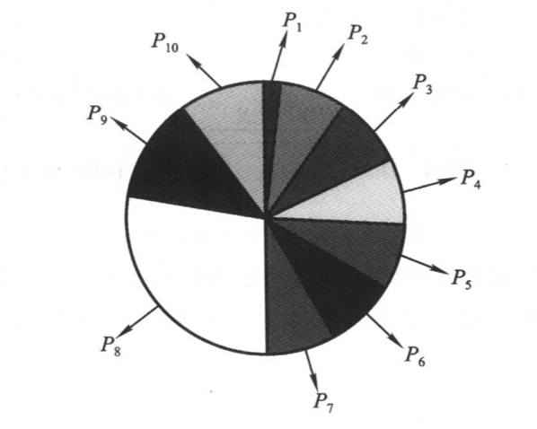
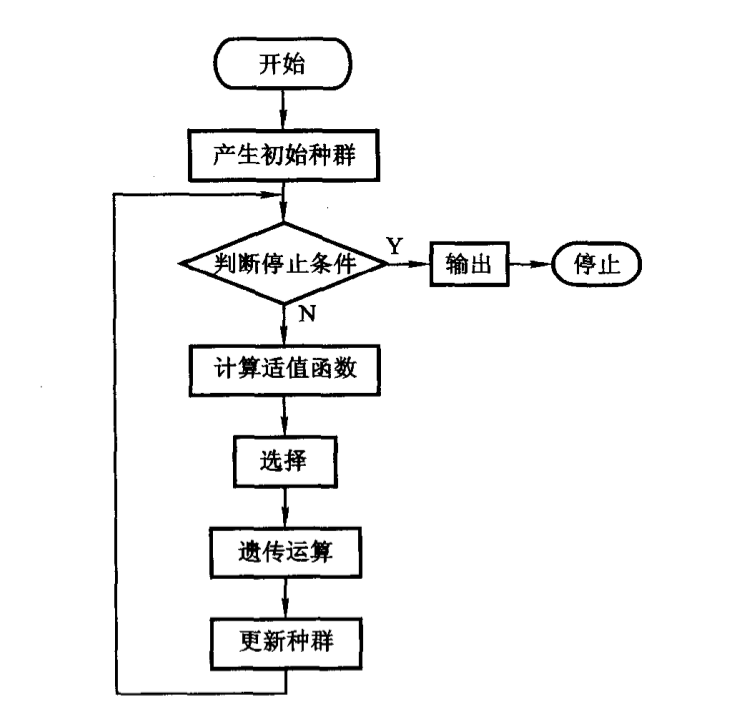
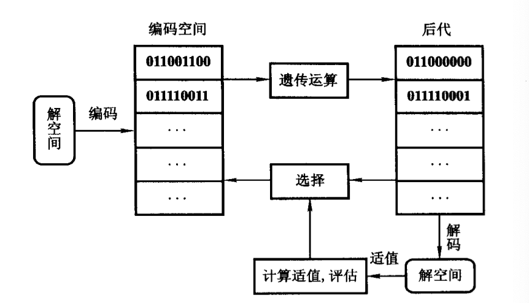

## 遗传算法

### 遗传算法的基本原理

根据问题的目标函数构造一个适值函数，对于一个由多个解（每个解对应一个染色体）构成的种群进行评估、遗传运算、选择，多代繁殖，获得适应值最好的个体作为问题的最优解

- 产生一个初始种群

- 根据问题的目标函数构造适值函数

  **适值函数：**目标函数$f(x)$，产生适值函数$F(x)$的过程称为标定，即转化为如下的优化问题：

  $F(x) = -\min f(x)$ 或者 $F(x) = \max f(x)$

- 根据适应值的好坏不断选择和繁殖

  适应值大的个体，基因容易被遗传到下一代

- 若干代后得到适应值最好的个体即为最优解

### 构成要素

- 种群和种群大小

  每个个体是一个染色体，每个染色体对应着一个问题的一个解，一般来说，群体规模越大，遗传算法效果越好

- 编码方法

  基因表达方法

  - 二进制编码

    染色体$X=(x_1,x_2,\cdots,x_n)，1\le i\le n$

    染色体每一位是一个基因，n称为染色体的长度

    二进制编码是适用于以下三种情况：

    - 背包问题
    - 实优化问题
    - 指派问题

- 遗传算子

  - 交叉（Crossover）

    - 交叉率（$P_c$）：提高交叉率会达到更大的解空间，减小停在非最优解上的机会，但是交叉率太高会因为过多搜索不必要的解空间而耗费时间
    - 变异率（$P_m$）：变异率控制新基因导入种群的比例，变异率过高会使得后代有可能失去

    交叉方法：

    - 单切点交叉

      随机选择一个切点，切点两侧分别看为两个子串，交换之

    - 双切点交叉

      随机选择两个切点，交换两个切点之间的子串

  - 变异（Mutation）

  

- 选择策略

  从种群中选择适应值高的个体以生成交配池的过程

  **正比选择策略**，即每个个体被选中遗传运算的概率为该个体的适应值和种群中个体适应值总和的比例，种群规模为$NP$

  得到选择概率$P_i$ 后，按照**旋轮法**（Roulette Wheel）实现选择操作
  $$
  PP_0 = 0\\
  pp_i = \sum_{j = 1}^iPP_j
  $$
  共转轮$NP$次，每次转轮时，随机产生$\xi_k\in U(0,1)$，当$PP_{i-1}\le\xi_k<PP_i$时，选择个体$i$.

  

  其他选择操作：

  - 随机便利抽样
  - 局部选择
  - 截断选择
  - 锦标赛选择

  选择操作的作用提高了群体适应度，降低了群体多样性

- 停止准则

算法流程

 解空间与编码空间转换

### 模版理论

定义：

- **模版**是若干位取确定值，其他位不确定的一类个体的总称，记为S

- **模版长度**$l(S)$定义为模版中从左到右第一个确定的位与最后一个确定的位之间的长度（算头不算尾）
- **模版的阶数**$K(S)$定义为模版中所含有的确定基因位的个数
- 阶数为$K(S)$的模版的个体总数为$2^{n-K(S)}$

模版理论：

引入了模版理论后，遗传算法的群体进化过程可以看作通过选择、交叉、变异等遗传算子的运算来不断寻找好的模版的过程。

**引理1：**

在正比选择（轮盘赌选择）下，模版S在$t+1$代的期望个体数为

$E(S,t+1) = f(S,t)N(S,t)$，其中$f(S,t)$是$t$代模版中所有个体的适应值的均值与种群中所有个体的适应值均值的比。

**引理2：**（单点交叉）

第$t$代以概率$P_c$做交叉，对长度为$l(S)$ 的模版中的个体，则在第$t+1$代中该个体仍然为$S$中个体的概率的下界为：

$P(S,t+1) \ge1-\frac{P_c\,l(S)}{n-1}(1-P(S,t))$ ，其中$P(S,t)$为第t代个体为模版S的概率

**引理3:**（变异）

若$t$代以概率$P_m$做变异，对于一个阶数为$K(S)$的模版S重点额个体，则在t+1代仍为S的概率的下界为

$P(S,t+1)\ge1-P_m\cdot K(S)$

**主定理（模版定理）：**

第t代以概率$P_c$和$P_m$发生交叉和变异的时候，长度为$l(S)$，阶数为$K(S)$，适应值均值为$f(S,t)$的模版S在第t+1代的期望的个体数的下界为：

$E(S,t) = [1-\frac{P_c\,l(s)}{n-1}(1-P(S,t))-K(S)P_m]f(S,t)N(S,t)$

如果：

$f(S,t)\ge[1-\frac{P_c\,l(S)}{n-1}(1-P(S,t))-K(S)P_m]^{-1}$

则$E(S,t)$随着代数t增加而增加。

### 改进与变形

#### 编码方法

- 顺序编码（1到n的自然数编码）
- 实数编码，适合于实优化问题
- 整数编码，适合于新产品投入、时间优化和伙伴挑选问题

#### 遗传运算中的问题

1. 顺序编码的合法性修复
   - 交叉修复策略
     - 部分映射交叉（PMX）
     - 顺序交叉（OX）
     - 循环交叉（CX）
   - 变异修复策略
     - 换位变异
     - 移位变异
2. 实数编码合法性修复
   - 凸组合交叉

#### 适值函数的标定

通过标定使得目标函数映射为适值函数

定义：**选择压力**

选择压力指种群中好、坏个体被选中的概率差，如果差较大则选择压力大，通过调节选择压力的大小可以实现遗传算法中局部搜索和广域搜索的调节

**局部搜索、广域搜索与选择压力的关系**

局部搜索是针对一个较小的区域进行搜索，致力于找到更好、更精确的解，而广域搜索是进行大面积的搜索，希望找到较好的解存在的区域，显然，局部搜索和广域搜索是遗传算法的一对矛盾

**适值函数的标定方法**

- 线性标定

  $F = af+b$

- 动态线性标定

- 幂律标定

  $F=f^\alpha$

   参数$\alpha$可以用来调节选择压力，$\alpha>1$时，选择压力大，$\alpha<1$选择压力小，$\alpha\rightarrow 0$时，将成为随机搜索

  缺点：计算耗费时间

- 对数标定

   $F = a\ln f+b$

- 指数标定

- 窗口技术

- 正规化技术

  最大化标定：$F = \frac{f-f_{min}+r}{f_{max}-f_{min}+r}$

  最小化标定：$F = \frac{f_{max}-f+r}{f_{max}-f_{min}+r}$

  其中$r\in(0,1)$

#### 选择策略

- 截断选择

  排序后选择最优的前T个个体，让每个有$1/T$的选择概率，即平均每个得到$NP/T$的概率被选择

- 顺序选择

  对$NP$个个体进行排序，定义最好的个体的选择概率为$q$，则个体$j$的选择概率为

   $p(j) = q(1-q)^{j-1}$

  概率归一化：当NP有限的时候，$\sum_{j=1}^{NP}q(1-q)^{j-1}<1$

  令$p_j = \bar{q}(1-q)^{j-1}$，其中$\bar{q} = \frac{q}{1-(1-q)^{NP}}$

- 正比选择（轮盘赌选择）

#### 停止准则

- 最大代数

- 收敛准则

  $|F_{max}-\overline{F}|<\varepsilon$

#### 高级基因操作

- 倒位操作

  在染色体中随机指定两个基因的位置为倒位点，以倒位概率$P_i$顺序翻转两个倒位点之间的基因

- 显性操作

  

### 约束的处理

优化问题的一般形式：

　$\min \quad f(x)\\\text{s.t.}\quad g(x)\le0\\\quad \quad\; h(x)=0$

问题：操作染色体的遗传算法常常会产生不可行的染色体问题，处理约束问题一般可以分为以下几类：

- 拒绝策略

  直接拒绝不可行解（非常低效）

- 修复策略

- 惩罚策略

  通过对不可行解的惩罚使之转化为无约束问题，需要设计适当的罚函数

- 特殊的编码和遗传策略

  在编码与遗传算子时就考虑约束

