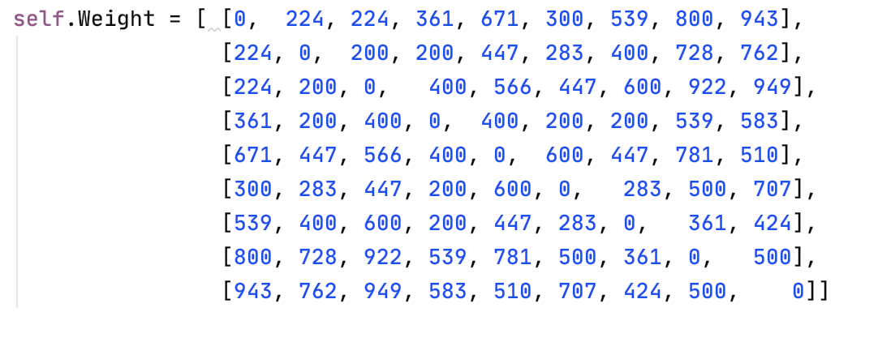
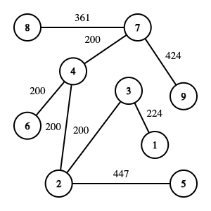

## 遗传算法解决最小生成树问题


### 算法概述

- 编码：顺序编码（prufer）
  1. 设节点i是标号最小的叶子
  2. 若i与j相连，令j是编码中的第一个数字，删去边 (i , j)
  3.  转step1，直到剩下一条边为止
- 交叉算子：传统单点交叉算子
- 选择策略：正比选择（轮盘赌选择）
- 度约束：3
- 修复策略：若个体B中的一个顶点v违反了度的约束，即$v$在B中出 现的次数大于 $d$ ($d$是度的约束)，则将多余的$v$随机替换为其他出现次数小于$d-1$的顶点

### 部分关键代码

- 解码(最小生成树编码与边集合映射)：

  ```python
      def code2solution(self, code, j):
          P_nor = []
          P = [0 for i in range(self.node_num+1)]
          ans = []
          for i in range(self.node_num):
              if (i+1) not in code:
                  P_nor.append(i+1)
          for i in range(self.code_length):
              P[code[i]] += 1
  
          index = 0
          for i in range(self.code_length):
              ans.append((P_nor[index], code[i]))
              index += 1
              P[code[i]] -= 1
              if P[code[i]] == 0:
                  l = len(P_nor)
                  for k in range(index, l):
                      if code[i] < P_nor[k]:
                          P_nor.insert( k, code[i])
                          break
                  if l == len(P_nor):
                      P_nor.append(code[i])
  
          ans.append((P_nor[index],P_nor[index+1]))
  
          return ans
  ```

  ​	解码算法：

  1. 令prufer数的节点集为 $P$,不包含在$P$ 中的节点集合记为$\overline{P}$
  2. 若i为$\overline{P}$中的最小标号的节点，j为$P$上最左边数字，连接$(i,j)$，$P$和$\overline{P}$中最左节点离开集合，若元素$n$不再出现在$P$ 中，即$n$变为叶子节点，将$n$加入$\overline{P}$中
  3. 重复step 2， 直到$P$中没有节点，此时$\overline{P}$一定剩下两个叶子节点${(s,r)}$
  4. 连接$(s,r)$

  ​	在实现的时候，出于速度考虑，并没有元素的实际出入列表$P$ 、$\overline{P}$，而是维护两个最左元素指针。在实现的时候，该函数的关键是，在一个节点离开$P$的时候，加入$\overline{P}$，仍然需要保证剩下的$\overline{P}$部分是有序的

- 度约束修复

  ```python
      def repair(self, target):
          if self.degree_constraint == 0:
              return
          box = [0 for i in range(self.node_num)]
          for i in range(self.code_length):
              box[target[i] -1] += 1
  
          change_flag = 0
  
          for i in range(self.node_num):
              if box[i] >= self.degree_constraint:
                  changeto = self.change(target, i+1, box[i])
                  box[changeto-1] += 1
                  box[i] -= 1
                  change_flag = 1
  
          if change_flag == 0:
              return
  
          return self.repair(target)
  
      def change(self, targetlist, repairNum, max_pos):
          change_pos = self.U_1_nth(max_pos)
          changeto = self.U_except(repairNum)
          index = 0
          for i in range(self.code_length):
              if targetlist[i] == repairNum:
                  index += 1
              if index == change_pos:
                  targetlist[i] = changeto
          return changeto
  ```

  ​	扫描code染色体编码进行边计数，采用桶计数的策略。当一个桶中的计数> 度约束-1，则表示该桶编号对应的边不满足度约束，需要将其替换为其他的边，随机选择一条边，替换后改变桶计数；由于替换可能导致其他边不满足度约束，因此只要发生了替换就发生，再次进行修复策略，其中递归函数的退出规则就是没有度约束或者所有边的桶计数都在度约束之内。

  ​	repair发生在初始化时候，发生在新的一代个体产生后。

### Result

 问题的邻接矩阵：



参数设置：

- NP: 500

- Max generation: 100

- mutation rate: 0.01

- crossover rate: 0.3

- Code length: 7

- Nodes: 9

- Eval: $100000/\text{Weight}$

  

**result:** $f([[(1, 3), (3, 2), (5, 2), (2, 4), (6, 4), (4, 7), (8, 7), (7, 9)]] ) =  2256$




