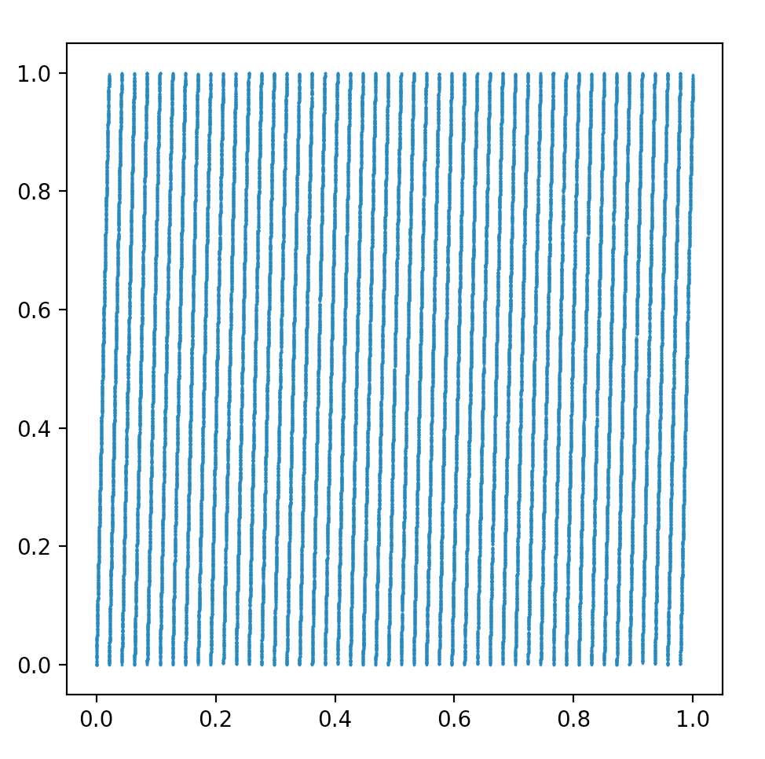
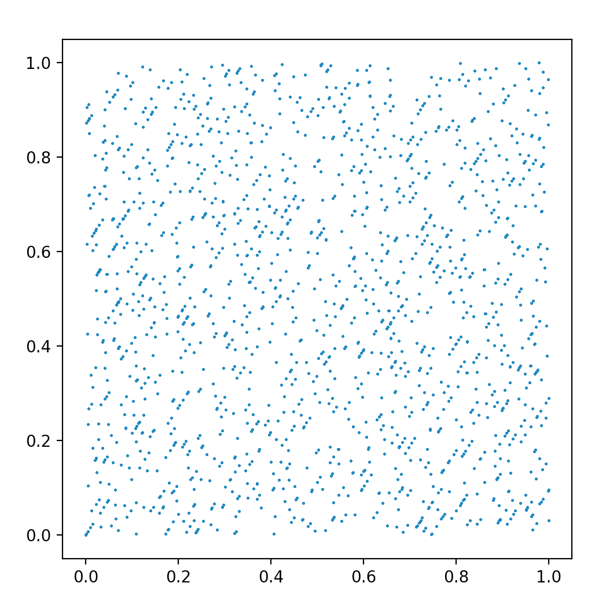
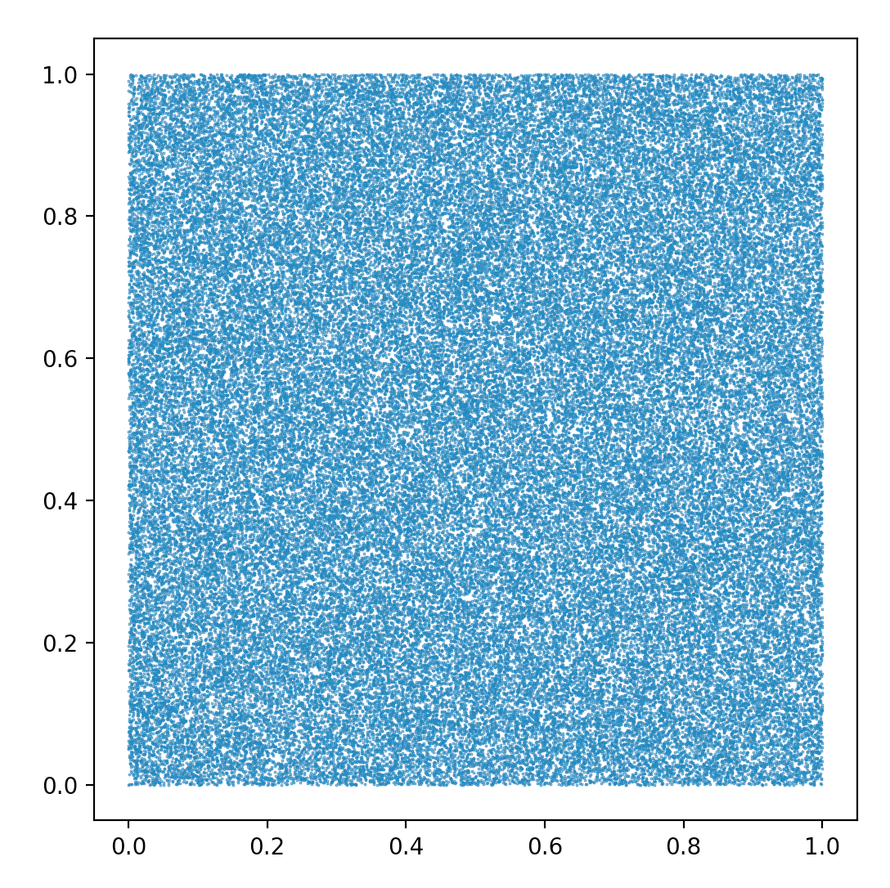
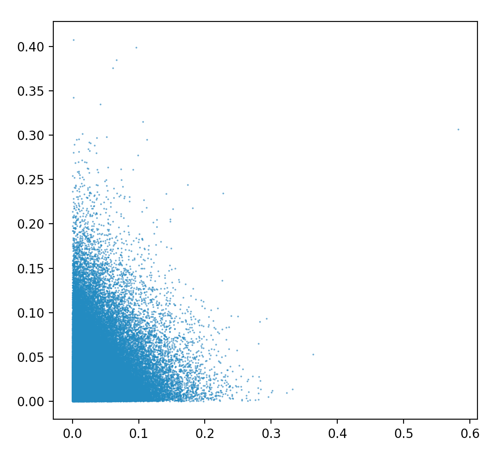
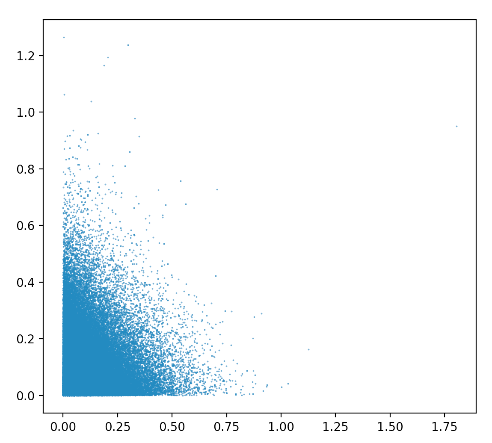
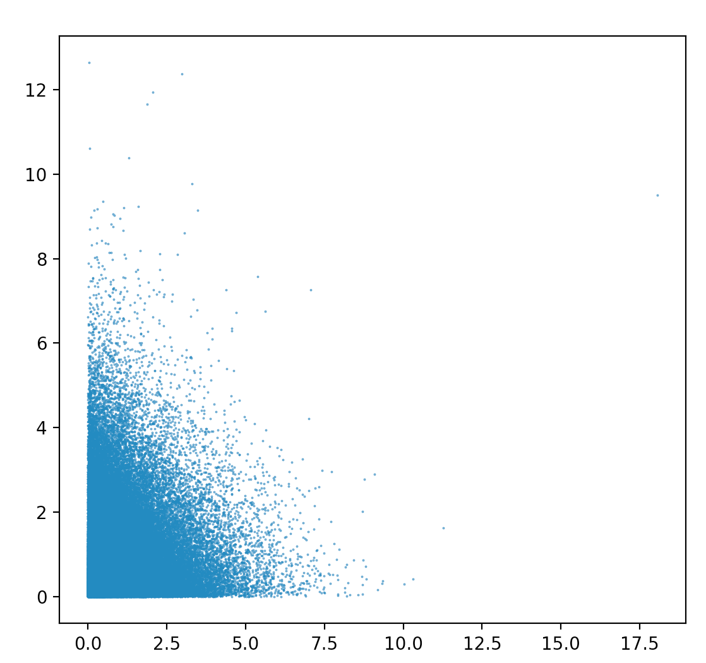

<center><font size = "6">Random</font></center>


### 随机数发生器

```python
# This is a simple pseudo-random number generator
import math
import matplotlib.pyplot as plt

def pseduo_random_even(A,M,n,x0):
    re = []
    re.append(x0)
    for i in range(1,n):
        re.append(A*re[i-1]%M)
    for i in range(n):
         re[i]/=M
    return re


def LCG(n,x0):
    re = []
    re.append(x0)
    for i in range(1, n):
        re.append((314159269 * re[i - 1] + 453806245) % (2**31))
    for i in range(n):
         re[i] /= (2**31)
    return re

def pseduo_random_negative_exponential_distribution(la,n,x0):
    res = LCG(n,x0)
    for i in range(n):
        res[i] = -1/la*(math.log(res[i],math.e))
    return res

# x = pseduo_random_even(3,2**30,10**5,1)
# y = pseduo_random_even(3,2**30,10**5,47)

# x = LCG(10**5,31)
# y = LCG(10**5,159269)

x = pseduo_random_negative_exponential_distribution(31,10**5,31)
y = pseduo_random_negative_exponential_distribution(31,10**5,159269)

plt.figure(figsize=(1, 1), dpi=100)
plt.scatter(x, y, s = 0.1)
plt.show()
```


- 在pseduo_random_even 函数中，我们实现了简单的乘同余伪随机数生成器

- 在LCG函数中，我们实现了Kobayashi提出的满周期$2^{31}$的混合同余发生器(之后给出参数)

- 在pseduo_random_negative_exponential_distribution函数中，我们实现了负指数分布伪随机数生成器，其中均匀$U(0,1)$分布的伪随机数生成器使用LCG函数

  

### 可视化

可视化的方法为生成独立同分布的两列随机数$(x,y)$，构成2维伪随机点的坐标列，实验点的数量为$10^5$.

### result

- 乘同余法，参数选取：$A = 3，M = 2^{30} ,x_0=1,47 $



  根据问题1中定理的建议，选择参数：$A = 3，M = 2^{30}-1 ,x_0=31,47 $，结果稍好




- Kobayashi提出了如下的满周期$2^{31}$的混合同余发生器

  $x_n = (314159269x_{n-1}+453806245)(\text{mod }2^{31})$， 我们取x，y的初值分别为$x_0=31, 156269$



- 利用上述质量很好的LCG生成的负指数分布伪随机数，其中$\lambda = 31,10,1$,  所有的内部LCG参数与上例相同

 

  这完全符合负指数“生存性”分布的特点


## Reference

[3] https://www.math.pku.edu.cn/teachers/lidf/docs/statcomp/html/_statcompbook/rng-uniform.html 

