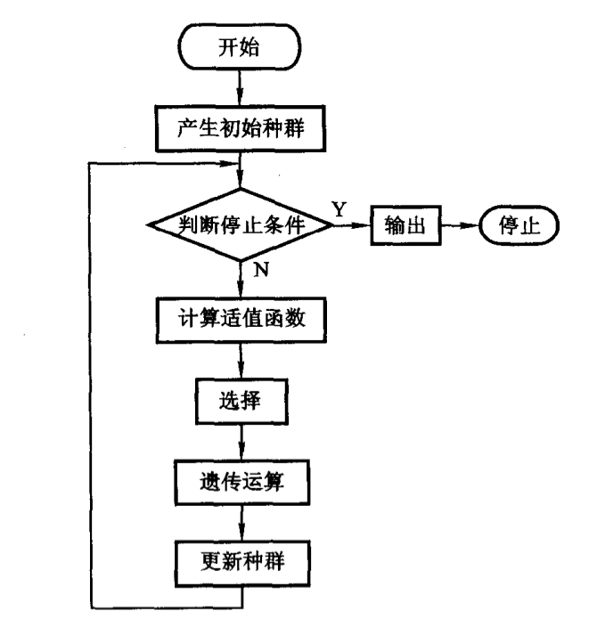
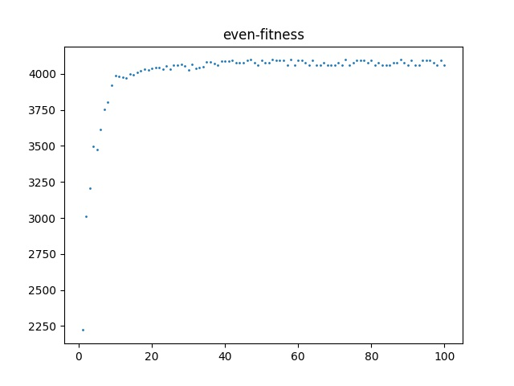
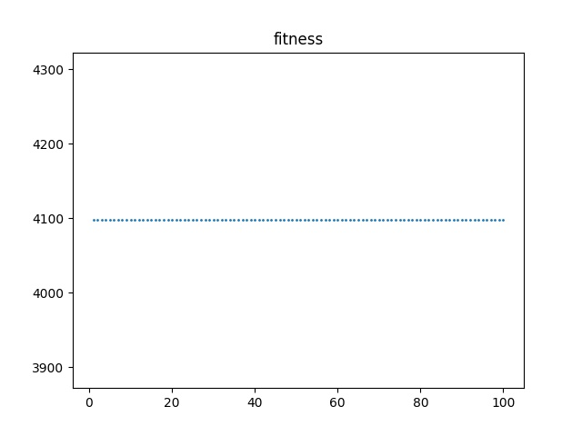
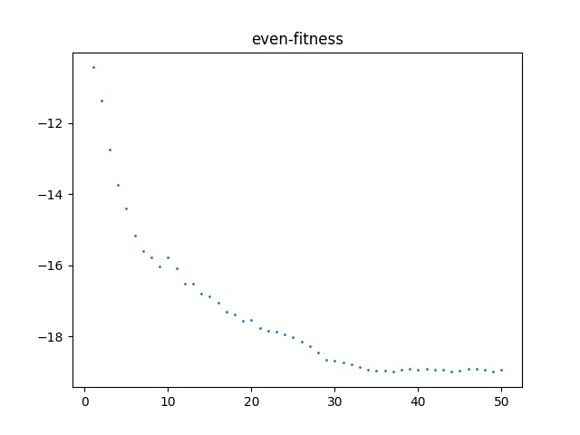
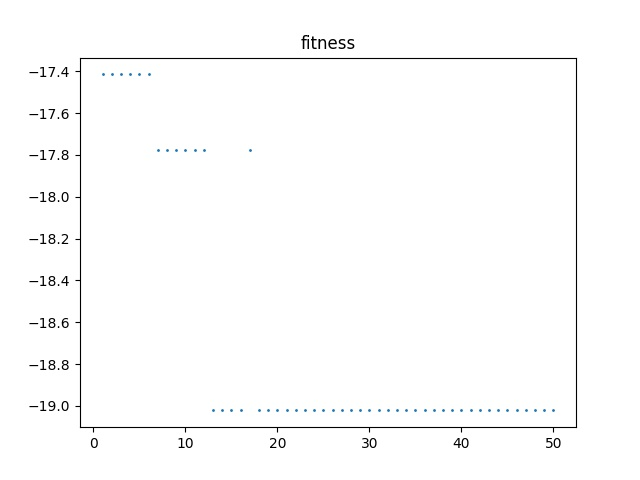
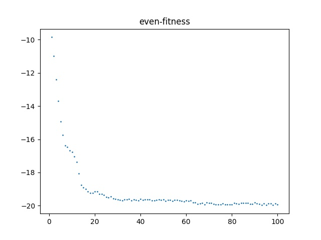
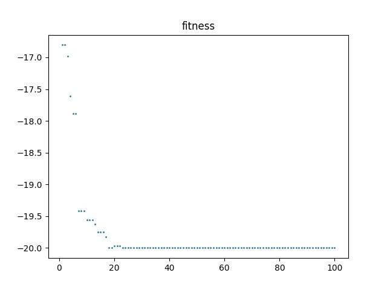
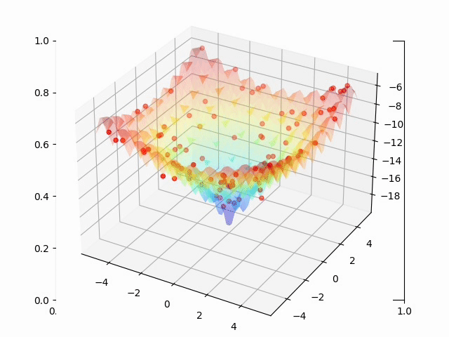

<center><font size = "6">GA_basic</font></center>

## 0: 一个维度无关的GA算法框架的实现

​	GA算法的框架如下图所示：



​	本维度无关的GA框架力求实现对于一个维度不确定的优化问题（需要调节的参量），只需额外实现n维的适值函数（与优化问题相关，通常为带求解问题方程描述的仿射(affine)），即可采用同一套框架求解。

- GA主循环框架：

  ```python
      def GA_main(self):
          print("start simulation: ", end='')
          for i in range(self.max_generation):
              self.progress_bar(i)  # this is progress bar
              self.calculate_fitness()
              self.get_new_generation()
              self.update_statistic()
          print(">!!")
  ```

  本GA算法采用‘最大代际次数’作为停止条件，主循环包括：

  - **计算种群适应度**

  - **产生新的种群**

    根据适应度更新适应度轮盘，而后按照遗传算子比率调用遗传算子‘选择’、‘交换’、‘突变’，产生新的种群

  - **更新统计信息**

    写入全部种群的解空间坐标（维度有关）、种群适应度最大值、适应度最小值、适应度平均值

    

- 参数设置：

  ```python
  class GA():
      def __init__(self, clength, generation, np, mR, cR, dim, is_max, solution_range, is_generate_mp4 = 0):
  			self.global_random_list_index = 1
  			self.random_list_length = 2 ** 20
  			self.random_list = []
  			self.file_path = './jpg1/'
  			self.generate_mp4 = is_generate_mp4
  
  			self.max_generation = generation
  			self.statistics = []
  
  			self.dim = dim
  
  			self.code_length = clength
  			self.NP = np
  			self.mutation_rate = mR
  			self.crossover_rate = cR
  			self.mutation_number = max(1, int(self.NP * self.mutation_rate))
  			self.crossover_pair_number = int(self.NP * self.crossover_rate * 0.5)
  			self.staying_number = self.NP - self.mutation_number - self.crossover_pair_number * 2
  			self.is_max = bool(is_max)
  
  			self.chromosome_father = [[[]for i in range(self.NP)]for j in range(dim)]
  			self.chromosome_son = [[[]for i in range(self.NP)]for j in range(dim)]
  			self.chromosome_buffer = [[[]for i in range(self.NP)]for j in range(dim)]
  			self.solution = [[[]for i in range(self.NP)]for j in range(dim)]
  			self.fitness = [[] for i in range(self.NP) ]
  			self.PP = [[]for i in range(self.NP)]
  			self.max = 1e5
  			self.min = -1e5
  			self.sum = 0
  			self.solution_range = solution_range
        
        self.GA_init()
  ```

  

- GA初始化：

  ```python
      def GA_init(self):
          self.random_list_update()
          for j in range(self.dim):
              for i in range(self.NP):
                  a_code = self.get_code()
                  self.chromosome_father[j][i] = a_code
                  self.chromosome_buffer[j][i] = a_code
                  self.chromosome_son[j][i] = a_code
                  self.fitness[i] = 0
                  self.PP[i] = 0
  ```

  产生初始种群，调用了产生定长随机编码的函数 ‘ get_code ’

  

- 随机数发生器group：

  GA算法中不同含义的随机数，称之为**随机数组**：

  - U：小数随机数，用于轮盘赌选择中，同时也是其他随机数的基本根级别函数

  - U(0, code_length)：整数随机数，位于[0, code_length) ，用于在遗传算子中选择一个位点进行操作

  - U(0, 1)：二进制随机数，用于生成编码的一个bit

  - U(0, NP)：整数随机数，位于[0, NP)，用于遗传算子中进行父代个体选择

    

  GA算法中多次需要生成不同含义的随机数，为了避免随机数被多次计算，一个有效率的方法是生成一个长度较大的随机数列，维护一个滑动指针，当指针溢出的时候，更新随机数列，同时所有的随机数产生的过程中都会使得指针自增，实现方法如下：

  其中LCG为上次作业中给出的质量较好的线性同余随机数发生器。

  ```python
      def random_list_update(self):
          self.random_list = r.LCG(self.random_list_length, int(time.time())%(2**31))
  
      def U(self):
          if self.global_random_list_index % (self.random_list_length-1) == 0:
              self.random_list_update()
              self.global_random_list_index = 0
  
          self.global_random_list_index += 1
          return self.random_list[self.global_random_list_index]
  
      def U0_1(self):
          return int(self.U() > 0.5)
  
      def U_NP(self):
          a = self.U()
          integer_part = int (a * self.NP)
          fraction_part =int( (a * self.NP - integer_part) >= 0.5 )
          res = integer_part + fraction_part
          if res >= self.NP:
              res = self.NP - 1
          return res
  
      def U_code(self):
          a = self.U()
          integer_part = int(a * self.code_length)
          fraction_part = int((a * self.code_length - integer_part) >= 0.5)
          res = integer_part + fraction_part
          if res >= self.code_length:
              res = self.code_length - 1
          return res
  ```

  

- 解空间与编码空间映射：

  - 定长编码产生：

    ```python
        def get_code(self):
            res = []
            for i in range(self.code_length):
                a_bit = self.U0_1()
                if a_bit == 0:
                    res.append(0)
                else:
                    res.append(1)
            return res
    ```

    

  - 编码空间到解空间映射：

    ```python
        def code2solution(self, code, j):
            ans = 0
            length = self.solution_range[j][1] - self.solution_range[j][0]
            for i in range(self.code_length):
                if code[i] == 1:
                    ans += 2**i
            return length/(2**self.code_length) * ans + self.solution_range[j][0]
    ```

    

    编码映射采用如下算法，对于每一个维度的 $\text{range}$，编码将编码空间分成了$2^{\text{code-length}}$份，则精度为$\text{range}/2^{\text{code-length}}$，则solution的值需要计算n位定长编码的**原码**，并平移 $\text{range}_{\text{min}}$

    

- 适值函数：

  这个是框架外的，需要手动修改

  ```python
      def fitness_function(self, coordinate):
          x = coordinate[0]
          y = coordinate[1]
          return math.e - 20*math.exp(-0.2*math.sqrt((x**2+y**2)/2))-\
                 math.exp(0.5*(math.cos(2*math.pi*x)+math.cos(2*math.pi*y)))
          
  ```

  计算适应度：

  ```python
      def calculate_fitness(self):
          coordinate = [[]for j in range(self.dim)]
          for i in range(self.NP):
              for j in range(self.dim):
                  coordinate[j] = self.code2solution(self.chromosome_father[j][i], j)
                  self.solution[j][i] = coordinate[j]
  
              self.fitness[i] = self.fitness_function(coordinate)
              self.max = max(self.fitness)
              self.min = min(self.fitness)
              self.sum = sum(self.fitness)
  
  ```

  

- 遗传算子：

  遗传算子包括选择、突变、交叉。

  在本框架中，选择采用均匀轮盘赌选择方法，突变采用单点突变算法，交叉采用单点交叉方法，但是这些方法很容易扩展：

  - 集合轮盘：

    ```python
        def gather_roulette_wheel(self):
            for i in range(self.NP):
                self.PP[i] = self.fitness[i]
            if self.is_max == 1:
                for i in range(self.NP):
                    self.PP[i] -= self.min
            else:
                for i in range(self.NP):
                    self.PP[i] *= -1
                    self.PP[i] += self.max
    
            for i in range(1,self.NP):
                self.PP[i] += self.PP[i-1]
    
            for i in range(self.NP):
                self.PP[i] /= self.PP[self.NP-1]
    ```

    轮盘的集合与优化问题有关，一个max优化问题和一个min问题的轮盘占比是不同的，集合的算法如下：

    首先按照max-min问题将适值函数仿射到非负数集，对于min优化问题，适应度为$F = f\, \text{max}-f(i)$， 对于max优化问题，适应度为 $F= f(i)-f \,\text{min}$，其中 $f$ 是适值函数。而后计算种群整体适应度$\text{sum}$，而后计算轮盘赌份额 $PP_i = F/\text{sum}$

  - 选择算子

    生成一个[0,1)小数随机数在轮盘上选择个体，结果的范围为[0,NP) 的整数（一个个体的编号）

    选择算子返回这个个体（父代中的一个个体）的n维编码

    ```python
        def selection_operator(self):
            choose_index = self.U()
            res = []
            for i in range(self.NP):
                if self.PP[i] >= choose_index:
                    for j in range(self.dim):
                        res.append(self.chromosome_father[j][i].copy())
                    return res
    
            for j in range(self.dim):
                res.append(self.chromosome_father[j][self.NP-1].copy())
            return res
    ```

  - 交叉算子

    返回两个交叉后的n维编码

    ```python
        def crossover_operator(self, code1, code2):
            index = [[]for j in range(self.dim)]
            res = [[]for j in range(self.dim)]
            for j in range(self.dim):
                index[j] = self.U_code()
                res[j].append(code1[j].copy())
                res[j].append(code2[j].copy())
                for i in range(0, index[j]):
                    res[j][0][i] = code2[j][i]
                    res[j][1][i] = code1[j][i]
            return res
    ```

  - 突变算子

    返回突变后的n维的编码

    ```python
        def mutation_operator(self, code):
            res = code.copy()
            which_bit = [[] for j in range(self.dim)]
            for j in range(self.dim):
                which_bit[j]= self.U_code()
                if code[j][which_bit[j]] == 0:
                    res[j][which_bit[j]] = 1
                else:
                    res[j][which_bit[j]] = 0
            return res
    ```

    

- 写入统计：

  ```python
      def update_statistic(self):
          res = []
          for j in range(self.dim):
              res.append(self.solution[j].copy())
          res.append(self.max)
          res.append(self.min)
          res.append(self.sum)
          self.statistics.append(res)
  ```

  

- 种群更新：

  ```python
      def get_new_generation(self):
          self.gather_roulette_wheel()
  
          for i in range(self.staying_number):
              tmp = self.selection_operator()
              for j in range(self.dim):
                  self.chromosome_son[j][i] = tmp[j].copy()
  
          left = self.staying_number
          right = self.staying_number + self.mutation_number
  
          for i in range(left, right):
              tmp = self.mutation_operator(self.selection_operator())
              for j in range(self.dim):
                  self.chromosome_son[j][i] = tmp[j].copy()
  
          left = self.staying_number + self.mutation_number
  
          for i in range(left, self.NP, 2):
              chromosome = self.crossover_operator(self.selection_operator(),self.selection_operator())
              for j in range(self.dim):
                  self.chromosome_son[j][i] = chromosome[j][0]
                  self.chromosome_son[j][i+1] = chromosome[j][1]
  
          self.deep_copy(self.chromosome_father, self.chromosome_son)
  
  ```

  

- utility

  用于生成一些图片和整个process的关键帧 ‘.jpg ’，用于合成动画

  ```python
      def print_variance(self):
          x = []
          y = []
  
          for i in range(self.max_generation):
              x.append(i+1)
              if self.is_max == 1:
                  y.append(self.statistics[i][2])
              else:
                  y.append(self.statistics[i][3])
  
          plt.figure("fitness")
          plt.title("fitness")
          plt.scatter(x, y, s = 1)
          name = self.file_path + 'fitness.jpg'
          plt.savefig(name)
          plt.show()
  
      def print_even(self):
          x = []
          y = []
  
          for i in range(self.max_generation):
              x.append(i+1)
  
              y.append(self.statistics[i][4]/self.NP)
  
          plt.figure("even-fitness")
          plt.title("even-fitness")
          plt.scatter(x, y, s = 1)
          name = self.file_path + 'even-fitness.jpg'
          plt.savefig(name)
          plt.show()
  
  
      def save_fig3D(self, i):
          n = 1000
          x, y = np.meshgrid(np.linspace(self.solution_range[0][0],self.solution_range[0][1]),
                             np.linspace(self.solution_range[1][0],self.solution_range[1][1]))
          z = np.e - 20*np.exp(-0.2*np.sqrt((x**2+y**2)/2))-\
                 np.exp(0.5*(np.cos(2*np.pi*x)+np.cos(2*np.pi*y)))
  
          fig = plt.figure("Surface")
          plt.title("Surface")
          ax3d = Axes3D(fig)
  
          ax3d.plot_surface(x,y,z,cmap='jet',alpha=0.2)
          ax3d.scatter(self.statistics[i][0],
                       self.statistics[i][1], self.fitness,color='r')
          name = self.file_path + 'fig'+str(i) + '.jpg'
          plt.savefig(name)
          plt.close(fig)
  ```

  

  

### 执行过程示例：

```python
## parameters describe:
# gene code length: 10
# max generation: 100
# NP: 100
# mutation rate: 0.01
# crossover rate: 0.3
# dimension: 2 that is:(x, y)
# is maximize optimization problem? 0 (false)
# solution space range: [[-5, 5],[5, 5]]: x in (-5,5); y in (-5, 5)
# need video, that is a sequence of jpgs? yes!

question1 = GA( 10, 100, 100, 0.01, 0.3, 2, 0, [[-5,5],[-5,5]],1)
question1.GA_main()

# GA utility:
question1.print_variance()
question1.print_even()
```


## T1

参数：

- 维度：1
- 编码长度：5
- NP：100
- max_generation：100
- 精度$acc_x = \frac{31}{2^5} = 0.96875$
- 解空间range：[0, 30]
- 突变率：0.01
- 交叉率：0.3

- 适值函数：

```python
    def fitness_function(self,coordinate):
        x = coordinate[0]
        return x**3 - 60 * x**2 + 900 * x +100
```

- result: $ f([10.3125] ) = 4097.100830078125$

 

## T2

执行过程与示例中一致，适值函数与框架展示中适值函数一致 

- 维度：2
- 解空间range：[[-5,5], [-5,5]]
- 突变率：0.01
- 交叉率：0.3

### try-out 1：

- 编码长度：6
- 精度：$acc_x = acc_y = \frac{10}{2^6} = 0.15625$
- NP：100
- max_generation：50
- result：$f( [-2.65625, 0.625]  ) = -19.02126938377459$

 

左图展示了种群平均适值函数值（优化目标函数）随代际变化结果，右图展示了种群最优的适值函数（优化目标函数）的值随代际变化结果


### try-out 2:

- 编码长度：10
- 精度：$acc_x = acc_y = \frac{10}{2^{10}} = 0.009765625$
- NP：100
- max_generation：100
- result：$f( [0.625, 0.625]  ) = -20.0$

 

左图展示了种群平均适值函数值（优化目标函数）随代际变化结果，右图展示了种群最优的适值函数（优化目标函数）的值随代际变化结果


