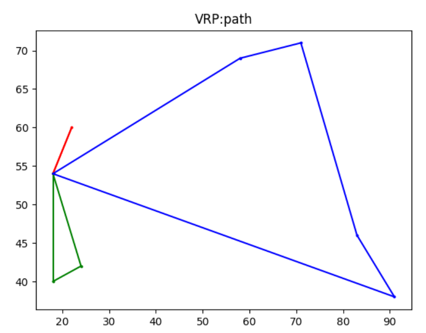
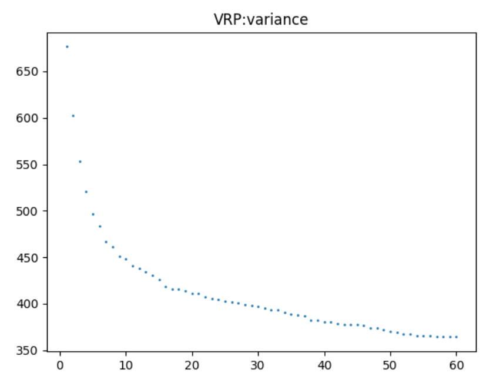
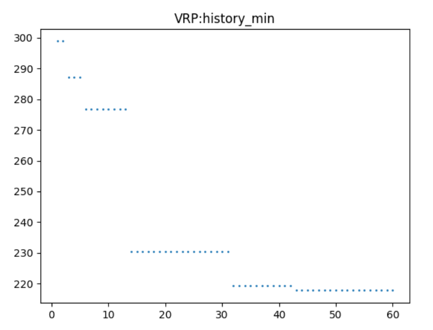

## 粒子群算法（PSO）解决无时间窗指派问题（VRP）

### 算法概述

粒子群作为体现群体智能的算法，可以用来解决该问题：无时间窗指派问题。

- 主循环：	

   ```python
       def PSO_main(self):
           print("start simulation: ", end='')
           for i in range(self.iteg):
               self.progress_bar(i)  # this is progress bar
               self.one_iteg()
               for i in range(self.quanta):
                   if self.global_optimizer > self.optimizer[i]:
                       self.pgv = self.piv[i]
                       self.pgr = self.pir[i]
                       self.global_optimizer = self.optimizer[i]
               self.update_statistic()
   
           print(">!!")
   
           w = self.global_optimizer
           p = self.verifiy_xr(self.pgv,self.pgr)
           self.path = p
           print("result: f(",end='')
           print(p, ") = ",w )
           self.end_time = time.time()
           print("run time: ", self.end_time-self.start_time,"s")
   ```

  主要步骤：

  ```python
   for i in range(self.iteg):
              self.progress_bar(i)  # this is progress bar
              self.one_iteg()
              for i in range(self.quanta):
                  if self.global_optimizer > self.optimizer[i]:
                      self.pgv = self.piv[i]
                      self.pgr = self.pir[i]
                      self.global_optimizer = self.optimizer[i]
              self.update_statistic()
  ```

  在外循环的迭代次数之内更新全局最优解。

- 内层循环：one_iteg()

  ```python
      def one_iteg(self):
          if self.NC_index != 0:
              self.update_v()
          self.update_x()
          self.eval_update_pi()
  ```

  - 在非初始的round中更新速度，公式为粒子群速度迭代公式：

    

    $v_i^{t+1} = \omega \times v_i^t+c_1(x_{\text{history\_optima}}^t-x_i^t)+c_2(x^t_{\text{global\_optima}}-x^t_i) \\x^{t+1}_i=v_i^{t+1}+x_i^t$

    ```python
        def listAdd(self,v,pi,pg,x):
            res = []
            for i in range(len(list1)):
                res.append( self.w*v[i] + self.c1*0.5*(1-self.w)*(pi[i]-x[i]) + self.c2*0.5*(1-self.w)*(pg[i]-x[i]) )
            return res
    
        def update_v(self):
            for i in range(self.quanta):
                self.vr[i] = self.listAdd(self.vr[i], self.pir[i],self.pgr,self.xr[i])
                self.vv[i] = self.listAdd(self.vv[i], self.piv[i],self.pgv,self.xv[i])
                for j in range(self.station):
                    if self.vr[i][j] > self.station -1:
                        self.vr[i][j] = self.station -1
                    if self.vr[i][j] < -self.station + 1:
                        self.vr[i][j] = -self.station+1
                    if self.vv[i][j] > self.car -1:
                        self.vr[i][j] = self.car -1
                    if self.vv[i][j] < -self.car +1:
                        self.vr[i][j] = -self.car +1
    ```

    在更新速度的同时，将速度规范化。

  - update_x

    ```python
        def update_x(self):
            for i in range(self.quanta):
                for j in range(self.station):
                    self.xr[i][j] += self.vr[i][j]
                    self.xv[i][j] += self.vv[i][j]
                    self.verifiy_xv(self.xv[i])
    ```

  - Eval_update_pi

    计算评分，更新每个粒子的历史最优

    ```python
        def eval_update_pi(self):
            res = 0
            for i in range(self.quanta):
                car_path = self.verifiy_xr(self.xv[i], self.xr[i])
                mark = self.eval(car_path)
                if mark <= self.optimizer[i]:
                    self.optimizer[i] = mark
                    self.pir[i] = self.xr[i].copy()
                    self.piv[i] = self.xv[i].copy()
                res += self.optimizer[i]
            self.even_optimizer = res / self.quanta
    ```

    其中verifiy_xr将车辆顺序的编码规范化，得到的car_path分别是n辆车的路径（回圈，包括了派发站），而eval函数则根据预存的路径坐标计算出得分，得分就选用路径长度。

    ```python
        def verifiy_xr(self, one_xv, one_xr):
            car_task = [[]for i in range(self.car)]
            car_num = [[]for i in range(self.car)]
            car_rank = [[]for i in range(self.car)]
            car_order = [[] for i in range(self.car)]
            car_path = [[]for i in range(self.car)]
            for i in range(self.station):
                car_task[one_xv[i]-1].append(one_xr[i])
                car_num[one_xv[i]-1].append(i+1)
    
            for i in range(self.car):
                car_path[i] = [0 for i in range(len(car_task[i])+1)]
                car_rank[i] = sorted(car_task[i])
            for i in range(self.car):
                for j in range(len(car_task[i])):
                    car_order[i].append(self.pos(car_task[i], car_rank[i][j]))
    
            for i in range(self.car):
                for j in range(len(car_task[i])):
                    car_path[i][car_order[i][j]] = car_num[i][j]
                car_path[i].append(0)
            #print(car_task)
            #print(car_num)
            #print(car_rank)
            #print(car_order)
            #print(car_path)
            return car_path
    ```

    返回的car_path具有如下的形式，一个二维list，例如最优解的car_path：

    ```python
    [[0, 1, 0], [0, 7, 6, 0], [0, 2, 3, 4, 5, 0]]
    ```

    表明1号车派发1号，经过0-1-0；2号车派发到6，7号，经过0-7-6-0；3号车派发2，3，4，5号，经过0-2-3-4-5-0。

    ```python
        def eval(self, car_path):
            res = 0
            for i in range(self.car):
                weight = 0
                res_in = 0
                for j in range(len(car_path[i])-1):
                    weight += self.gi[car_path[i][j]]
                    res_in += self.dis[car_path[i][j]][car_path[i][j+1]]
                    res += self.dis[car_path[i][j]][car_path[i][j+1]]
    
                if weight >= self.car_max:
                    res += (math.ceil(weight)-1) * res_in
    
            return res
    ```

    在eval函数中，根据car_path来计算路径，注意到，由于车辆载荷有限，因此可以这样认为，如果一个回圈的载荷量w超过了车辆额定载荷（本题是1），那么首先对w取一个向上取整ceil，然后需要额外跑$(\text{ceil}(w)-1)\times\text{path length}$，比如0-1-2-0超过了载荷，则实际的路径为0-1-0-2-0，额外跑了一趟，因此总路径计算要加上$(\text{ceil}(w)-1)\times\text{path length}$。当然这个算法是合理的启发式估计（比如并没有纠结从哪里返回之类的这种局部罚分的优化）。

  - 以上就是内循环one_iteg的细节。

  

### Result：

对于题目给定的问题，规模较小，因此可以结果较好：

路径最优值：217.8135

```python
result: f([[0, 1, 0], [0, 7, 6, 0], [0, 2, 3, 4, 5, 0]] ) =  217.81354876458738
run time:  0.7806370258331299 s
```



- 下图展示了以粒子群全体粒子的历史最优解的评分的平均值作为参数，参数随迭代次数的变化



- 下图展示了全局（群体内）最优解的评分随迭代次数的变化

  

### 其他实现

- SA、TS这类基于邻域查找的算法

  由于该编码涉及发货车辆与发货顺序，且二者是耦合的，而邻域查找类算法的最根本核心在于根据当前值与邻居操作快速算出新的得分差距，而如果对于本问题，我们仍然将编码（二维度）随机两位的交换定义为邻居操作，则每一步都要进行规范化，失去了快速计算邻域的能力。

  另一个问题就是，由于随机交换定义的邻域没有引入车辆间的派发数目这一拆分问题，因此不会命中与路径顺序无关的最优解。

- GA

  仍然采用上述的编码，交叉算子的设计定义为随机单位点交叉，（也就是交换只改变车辆的发货顺序、），不改变某车辆的发货站点数目，那么对于车辆发货站点数目的改变（拆分问题），则完全由变异算子引入。而车辆的路径交换与车辆派发站点拆分对于优化最终结果是等价。因此变异率和交叉率作为引入新个体的概率都会很高，而变异会带来派发顺序这一维度的顺序编码不合法（因为车辆的派发数目变了，意味着引入了新的分组），从而每一次变异都需要一次规范化。对于变异、交叉这些算法的基本操作，时间开销很大。

