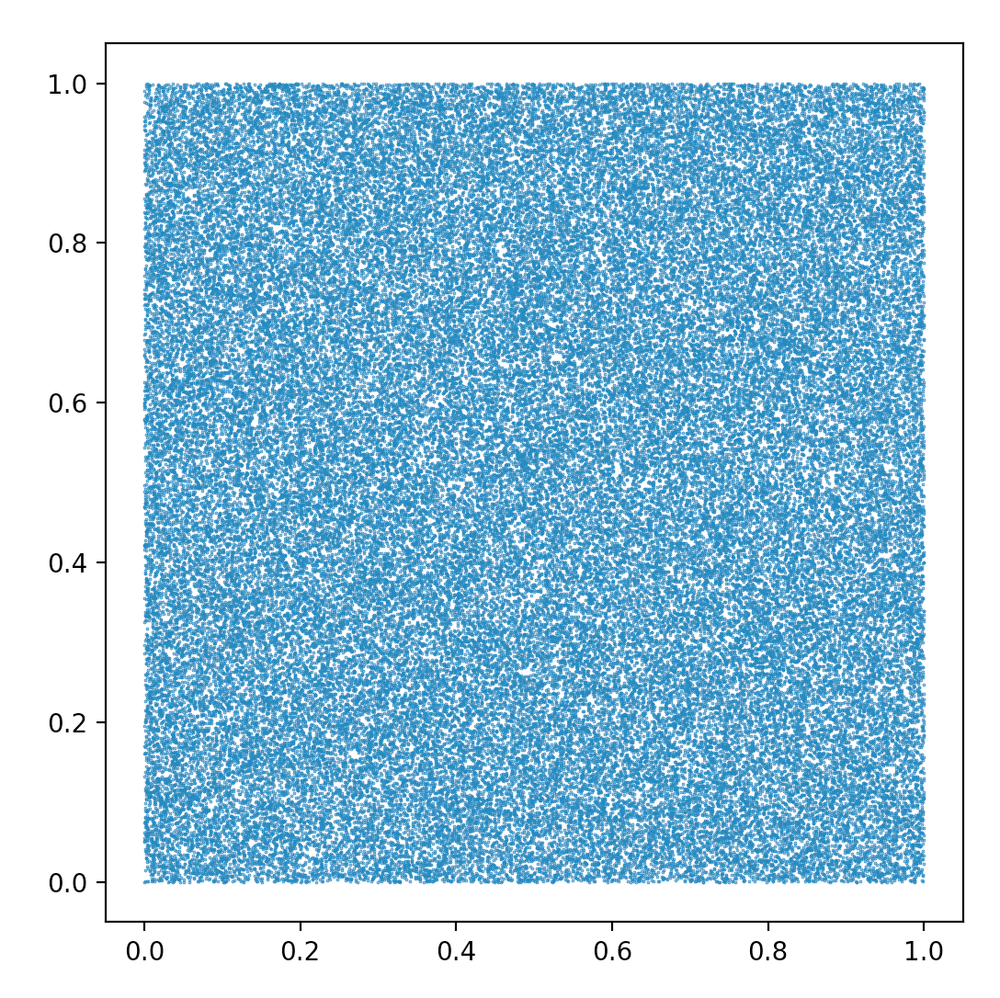
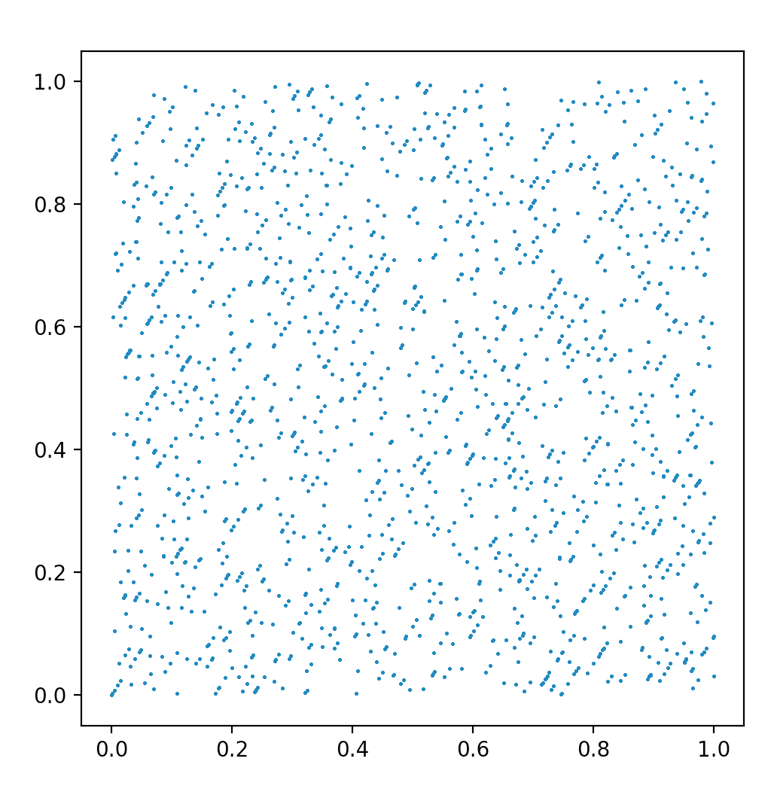
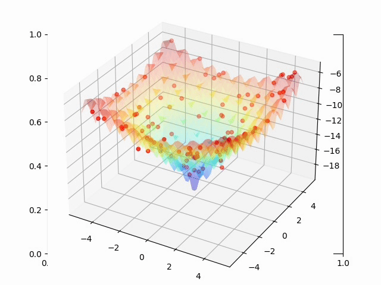
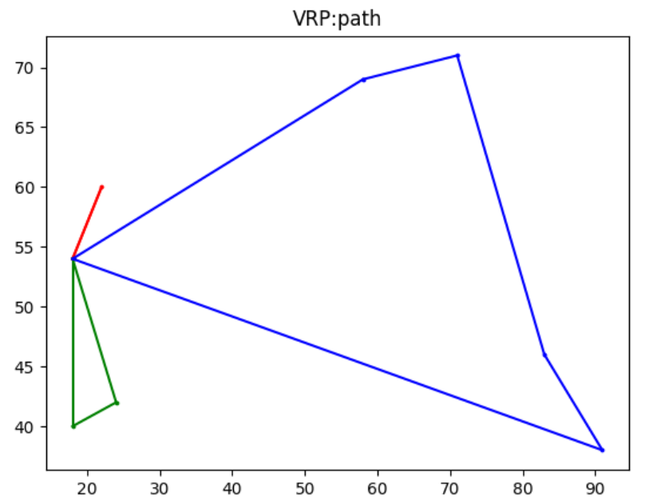

# IOM_FALL_2021
​	This is a repository of the course of Intelligent Optimization Methods, Fall 2021.

​	This project may include some code example for solving toy problem and some NP-hard open problem.

​	Those content may included:

- pseudo-random numbers

  

- GA algorithm

  - Basic discrete optimization problem

    

  - Minimum spanning tree  problem

  - TSP problem

    ps: A great website: http://elib.zib.de/pub/mp-testdata/tsp/tsplib/tsplib.html

- TS algorithm

  - TSP problem set

- SA algorithm

  - TSP problem set
  - Tournament ranking problem set

- ACA algorithm

  - Package problem set

- PSO algorithm

- - VPR problem set

    

### Search Algorithem is a perminent topic on optimization :-)

## Have fun!

