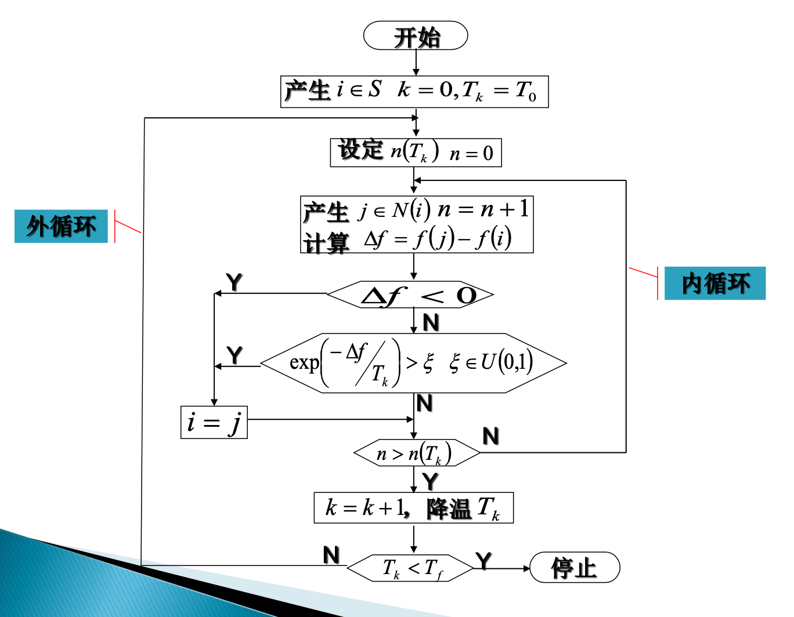
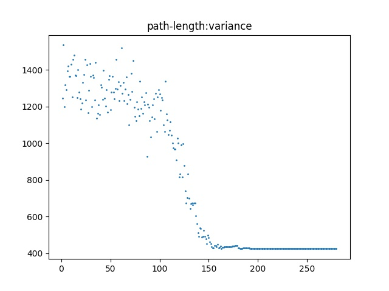
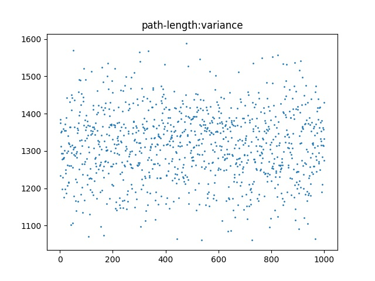
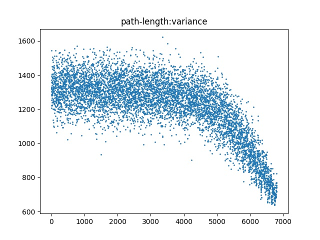
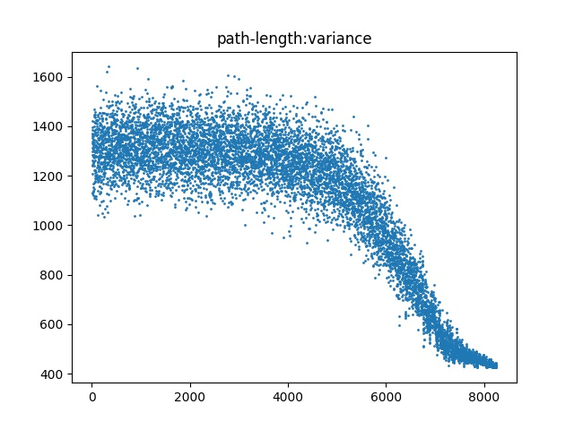
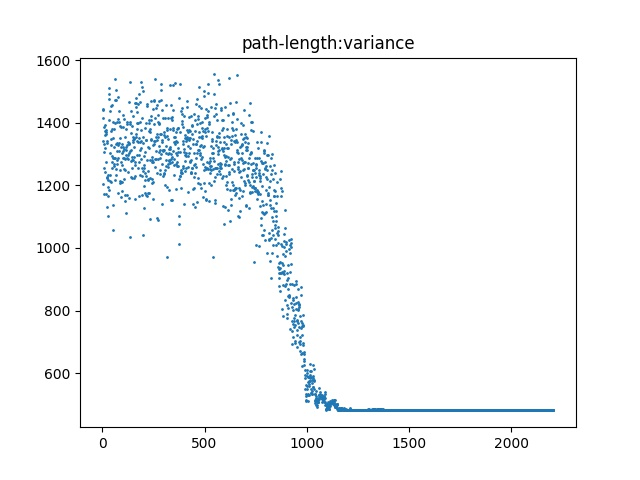
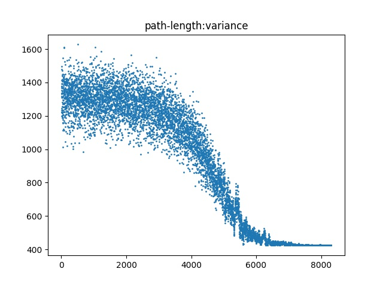
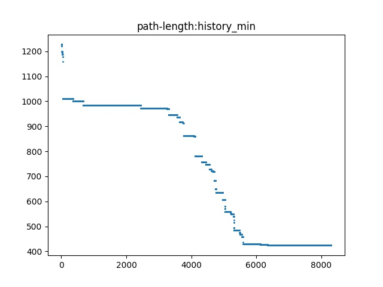

## 使用模拟退火(SA)方法求解TSP NP完全问题

### 算法流程

（图片来源于课件）



### 模拟退火问题的关键要素：

三函数两准则：

- 邻域选择函数

  本算法使用随机交换两个编码bit作为一步邻域

  ```python
   def W(self, i,j):
          return self.Weight[i-1][j-1]
  
  
      def cross_score_change(self, pos1, pos2):
          pos1_ = self.code[pos1]
          from1_ = self.code[(pos1-1)%(self.node_num)]
          to1_ = self.code[(pos1+1)%(self.node_num)]
  
          pos2_ = self.code[pos2]
          from2_ = self.code[(pos2 - 1) % (self.node_num)]
          to2_ = self.code[(pos2 + 1) % (self.node_num)]
  
          if to2_ == pos1_:
              res = -self.W(pos1_, to1_) - self.W(pos2_, from2_)\
                   + self.W(pos2_, to1_) + self.W(pos1_, from2_)
              return res
          if to1_ == pos2_:
              res = -self.W(pos1_,from1_ ) - self.W(pos2_, to2_)\
                  + self.W(pos2_,from1_) + self.W(pos1_, to2_)
              return res
          else:
              res = - self.W(pos1_,from1_) - self.W(pos1_, to1_)\
                - self.W(pos2_,from2_) - self.W(pos2_, to2_)\
                + self.W(pos1_,from2_) + self.W(pos1_, to2_)\
                + self.W(pos2_,from1_) + self.W(pos2_, to1_)
          return res
  
  
  ```

  上面的代码以O(1)的开销（与编码长度无关）实现了邻域转换能量变化的求解（cross_score_change(pos1, pos2)）。

  - 编码的初始生成过程，使用TSP次序编码逐位随机生成算法，而后转为路径编码

- 状态跳转函数

  模拟退火算法的核心：对于一个随机的状态跳转，采用 $U(0,1)\le\exp(-\Delta E/T_k)$ 作为接受跳转的条件。

  该条件有以下的性质：

  - $U(0,1)\le1\le\exp(-\Delta E/T_k)$，从而如果跳转使得体系能量降低，则一定被接受，保证了算法‘寻优’的能力
  - 当$1\ge\exp(-\Delta E/T_k)$的时候，转移以概率$P(\Delta E,T_k) =\exp(-\Delta E/T_k)$被接受，保证了算法‘爬坡’的能力
  - 当$T\rightarrow \infin$的时候，转移以概率1被接受，从而初始状态下解空间等于全空间，保证算法的潜在全局最优性
  - 当$T\rightarrow0$的时候，算法为符号‘-’的示性函数，即几乎只接受寻优解（值向目标方向靠近），从而保证了算法的局部最优性，并且快速收敛

  ```python
  
      def accept(self, gap):
          return self.U() <= math.exp(-gap/self.T)
  
      def get_one_neighbor_or_self(self):
          pos1_ = self.U_1_nth(self.node_num)
          pos2_ = self.U_1_nth(self.node_num)
          if pos1_ == pos2_:
              return (self.code.copy(), 0)
          pos1 = max(pos1_, pos2_) - 1
          pos2 = min(pos1_, pos2_) - 1
  
          gap = self.cross_score_change(pos1, pos2)
          gap_ = 0
          code_copy = self.code.copy()
          if self.accept(gap):
              gap_ = gap
              tmp = code_copy[pos1]
              code_copy[pos1] = code_copy[pos2]
              code_copy[pos2] = tmp
  
          return (code_copy, gap_)
  ```

  get_one_neighbor_or_self() 实现了内层循环中一次求解状态转移（或者不转移）。

- 温度更新函数

  本算法采用了指数级降温函数

  ```python
  self.T *= self.Temperature_Multipler
  ```

- 抽样稳定准则

  本算法采用Metropolis抽样稳定理论中的双阈值，认为连续的inner_stop_condition次数的状态转移没有改变最优解，则采样稳定。

  内层循环：

   ```python
       def inner_cyc(self):
           old_code = self.code.copy()
           if self.inner_stop_condition == 0:# use specific step stop condition
               for i in range(self.inner_step):
                   code_gap = self.get_one_neighbor_or_self()
                   self.code = code_gap[0]
                   self.fitness += code_gap[1]
           else:
               index = 0
               for i in range(self.inner_step):
                   code_gap = self.get_one_neighbor_or_self()
                   print(code_gap)
                   if self.code == code_gap[0]:
                       index += 1
                   else:
                       self.code = code_gap[0]
                       self.fitness += code_gap[1]
                       index = 0
   
                   if index == self.inner_stop_condition:
                       break
   
           if self.history_min > self.fitness:
               self.history_min = self.fitness
               self.history_min_code = self.code
   
           if old_code == self.code:
               return 1
           return 0
   ```

  

- 全局停止准则

  本算法采用了最大步数停止准则加上判定收敛停止准则，参数取名为outer_stop_condition，表明在连续的outer_stop_condition次迭代中，编码与适值函数的值不发生改变，采样收敛，判断停止。当outer_stop_condition==0的时候表明不开启判定收敛停止准则，默认采用最大迭代步数停止准则

  ```python
      def SA_main(self):
          print("start simulation: ", end='')
          if self.outer_stop_condition == 0:
              for i in range(self.outer_step):
                  self.progress_bar(i)  # this is progress bar
                  self.inner_cyc()
                  self.update_statistic()
                  self.T *= self.Temperature_Multipler
          else:
              index = 0
              for i in range(self.outer_step):
                  self.progress_bar(i)  # this is progress bar
                  index += self.inner_cyc()
                  self.update_statistic()
                  if index == self.outer_stop_condition:
                      break
                  self.T *= self.Temperature_Multipler
  
          print(">!!")
  
          w = self.history_min
          print("result: f(",end='')
          print(self.code2edge(self.history_min_code), ") = ",w )
          self.end_time = time.time()
          print("run time: ", self.end_time-self.start_time,"s")
  ```

  

### 参数与调用过程：

```python

# parameters describe:
# code length: 30
# SA max inner step: 100
# SA max outer step: 10000
# SA inner convergence condition: 0(do not use), [1, max_inner_step]
# SA outer convergence condition: 0(do not use), [1, max_outer_step]
# SA initial Temperature: T0
# SA Temperature Multiplier: T_k+1 = T_k * TMultiplier
#parameter list:
#clength, inner_step, outer_step, inner_stop_condition, outer_stop_condition, T0, TMultipiler

question1 = SA(30, 100, 10000, 0, 1000, 2000, 0.999)
question1.SA_main()
question1.print_even()
question1.print_variance()
#print(question1.statistics)
```

### 分析

#### case 0:

- 退火过程过快：
- 策略：提高温度乘数的值，

```python
参数：question1 = SA(30, 1000, 10000, 100, 100, 10000, 0.95)
控制台：
result: f([(24, 25), (25, 26), (26, 29), (29, 27), (27, 28), (28, 16), (16, 17), (17, 22), (22, 23), (23, 30), (30, 12), (12, 13), (13, 4), (4, 5), (5, 6), (6, 1), (1, 2), (2, 18), (18, 3), (3, 9), (9, 11), (11, 7), (7, 19), (19, 20), (20, 21), (21, 10), (10, 8), (8, 14), (14, 15), (15, 24)] ) =  424.9002540077754
run time:  1.3502130508422852 s
```



#### case 1:

- 外循环总体循环次数不足（还未退火冷却）
- 策略：增强退火过程

```python
参数：
question1 = SA(30, 1000, 1000, 100, 100, 10000, 0.999)
控制台：
result: f([(4, 29), (29, 2), (2, 23), (23, 28), (28, 27), (27, 25), (25, 1), (1, 19), (19, 20), (20, 30), (30, 6), (6, 13), (13, 8), (8, 26), (26, 15), (15, 24), (24, 18), (18, 12), (12, 16), (16, 22), (22, 3), (3, 9), (9, 11), (11, 14), (14, 17), (17, 5), (5, 10), (10, 21), (21, 7), (7, 4)] ) =  1060.7720896369715
run time:  7.0191850662231445 s
```



#### case 2:

- 等温过程不足，（末尾有纵向很宽的尾巴），这是由于内循环的终结条件达成时，体系还未收敛到局部极小值附近，从而使得退火效果不佳
- 策略：增强等温过程

```python
参数：
question1 = SA(30, 50, 10000, 10, 100, 10000, 0.999)
控制台：
result: f([(2, 20), (20, 19), (19, 21), (21, 10), (10, 14), (14, 15), (15, 24), (24, 25), (25, 3), (3, 9), (9, 7), (7, 8), (8, 26), (26, 27), (27, 28), (28, 29), (29, 16), (16, 23), (23, 30), (30, 22), (22, 13), (13, 5), (5, 6), (6, 12), (12, 11), (11, 18), (18, 17), (17, 4), (4, 1), (1, 2)] ) =  637.41066268759
run time:  2.3451390266418457 s
```



#### case 3:

- 内层循环基本跑满，但是外层循环提前达成了一个判断收敛停止条件，从而错失收敛到最优解。（可以理解为从次优解到最优解的收敛也具有一定过程）
- 提高外层循环的判断收敛停止条件值

```python
参数：
question1 = SA(30, 200, 10000, 100, 100, 10000, 0.999)
控制台：
result: f([(25, 24), (24, 15), (15, 14), (14, 8), (8, 7), (7, 11), (11, 10), (10, 21), (21, 20), (20, 19), (19, 18), (18, 9), (9, 3), (3, 2), (2, 1), (1, 6), (6, 5), (5, 4), (4, 13), (13, 12), (12, 30), (30, 23), (23, 22), (22, 17), (17, 16), (16, 28), (28, 27), (27, 29), (29, 26), (26, 25)] ) =  423.94904176402827
run time:  11.225541114807129 s
```



#### case 4:

- 过高初温：外部循环的收敛步数需要很大，否则就会与case1情形一致；如果想保持外部循环次数，则需要缩小温度乘数，却会使得算法过快收敛，从而与case0情形一致

```python
参数：
question1 = SA(30, 200, 10000, 0, 1000, 200000, 0.99)
控制台：
result: f([(18, 3), (3, 9), (9, 26), (26, 25), (25, 27), (27, 28), (28, 29), (29, 16), (16, 17), (17, 22), (22, 23), (23, 30), (30, 5), (5, 6), (6, 1), (1, 2), (2, 4), (4, 13), (13, 12), (12, 19), (19, 20), (20, 21), (21, 10), (10, 14), (14, 15), (15, 24), (24, 8), (8, 7), (7, 11), (11, 18)] ) =  480.9727050755449
run time:  3.281129837036133 s
```




### Result

```python
参数：
question1 = SA(30, 100, 10000, 0, 1000, 2000, 0.999)
控制台：
result: f([(8, 14), (14, 15), (15, 24), (24, 25), (25, 26), (26, 27), (27, 28), (28, 29), (29, 16), (16, 17), (17, 22), (22, 23), (23, 30), (30, 12), (12, 13), (13, 4), (4, 5), (5, 6), (6, 1), (1, 2), (2, 3), (3, 9), (9, 18), (18, 19), (19, 20), (20, 21), (21, 10), (10, 11), (11, 7), (7, 8)] ) =  423.7405631331586
run time:  5.8039727210998535 s
```






​	这组参数可以提供平均6s内的运行时间，10次测试的全局最优解命中率具有50%。（小样本测试）

