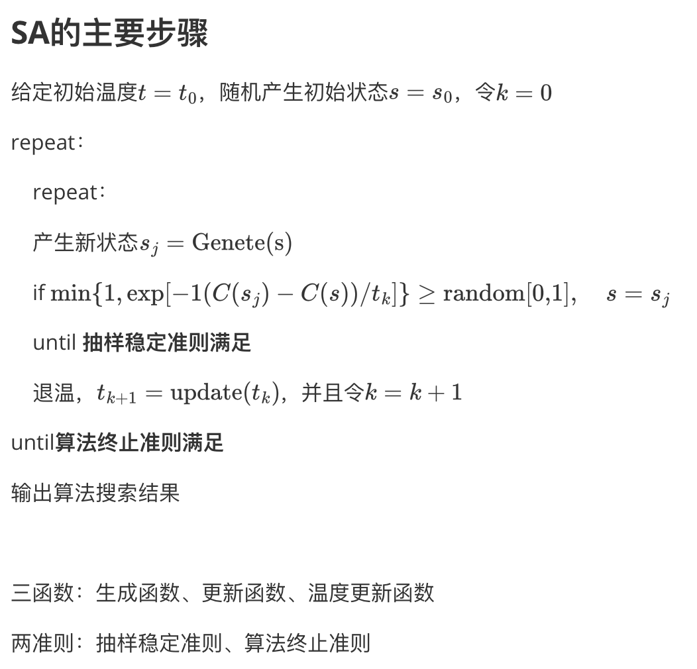
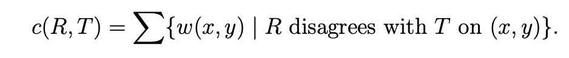
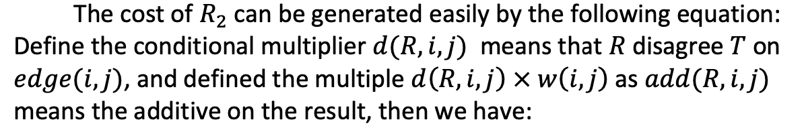
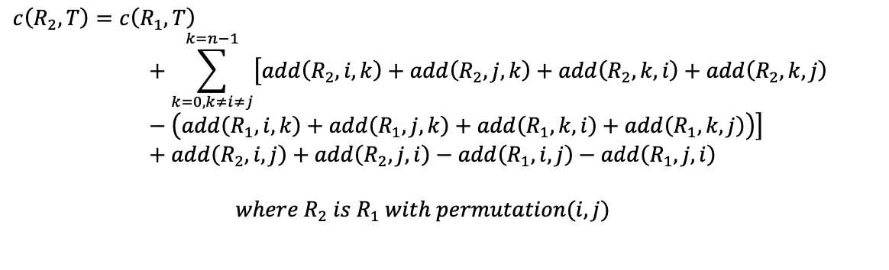
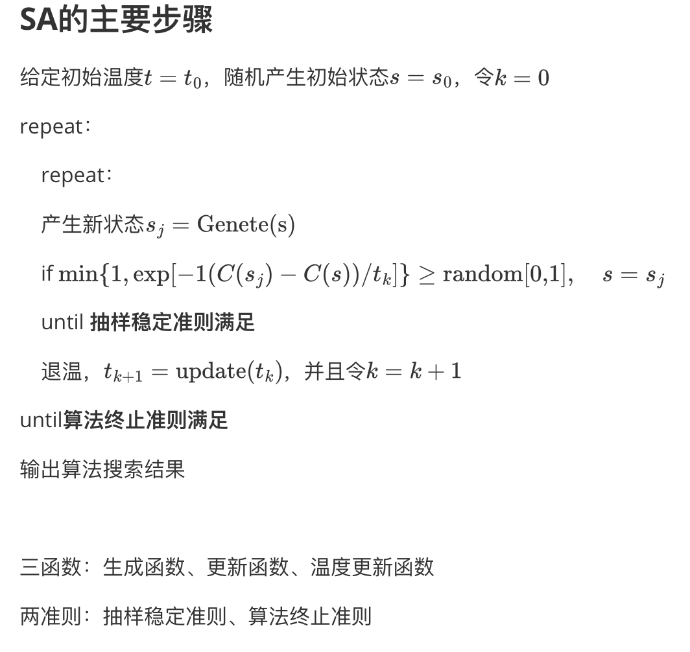
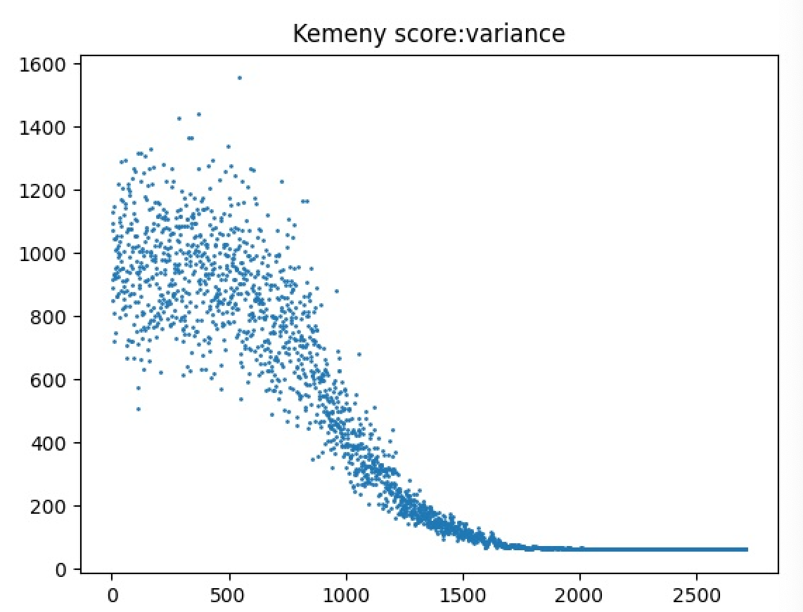

## SA_.py 代码说明

SA的框架特别的简单，就是这样子：



​	然后这份代码的框架也是这样子的：

- 首先是类的初始化：

  ```python
  def __init__(self, clength, inner_step, outer_step, inner_stop, outer_stop, T0, TMultiplier):
          self.global_random_list_index = 1
          self.random_list_length = 2 ** 20
          self.random_list = []
          self.start_time = time.time()
          self.end_time = self.start_time
          self.file_path = './'
  
          self.statistics = []
          self.node_num = clength
          self.code = []
          self.fitness = 0
          self.result = []
          self.max = 1e5
          self.history_min = 1e5
          self.history_min_code = []
          self.inner_step = inner_step
          self.outer_step = outer_step
          self.inner_stop_condition = inner_stop
          self.outer_stop_condition = outer_stop
          self.name = [[]for i in range(self.node_num)]
          self.neighbors_score = [[]for i in range(self.node_num)]
          self.Weight = [[ 0 for i in range(self.node_num)] for j in range(self.node_num)]
          self.T = T0
          self.T0 = T0
          self.Temperature_Multipler = TMultiplier
  ```

  

  这些参数有些是算法相关的，比如初始温度、更新参数a，有些就是要存储的结构，比如说在迭代时候更新的最优解，以及最后要画图时候用的statistics

  上面这个结构是在实例化的时候就产生了，这时候文件读取的参数无法直接体现在类成员变量里边，所以我们还需要

- 在外面（SA_main.py）把文件读取的权重和参与者的名字加进去

- SA_init

  ```python
   def SA_init(self):
          self.random_list_update()
          self.code = [(i) for i in range(self.node_num)]
          self.history_min = self.fitness_function(self.code)
          self.fitness = self.fitness_function(self.code)
          self.history_min_code = self.code
  ```

  这个是算法的初始化，初始化包括

  - 首先更新随机数列，然后按照教授的要求把初始的code加入进去，然后计算一下这个code的Kemency score。其中这个分数的计算就是按照这个公式：

    

    ```python
    def fitness_function(self, code):
            w = 0
            for i in range(self.node_num):
                for j in range(self.node_num):
                    w += int(code[i] > code[j]) * self.Weight[i][j]
            return w
    
    ```

    R disagree with T这个条件的体现就是int(code[i] > code[j])，因为有权重意味着这个参与者winner，但是它的rank确更高，因此会产生惩罚。注意到如果这个参与者本身是loser，那么权重也是0，所以上面这个代码 w += int(code[i] > code[j]) * self.Weight[i][j\] 才成立。

- 主循环：SA_main

  ```python
   def SA_main(self):
          print("Simulation start: ", end='')
          self.SA_init()
          step = self.outer_step
          if self.outer_stop_condition == 0:
              for i in range(self.outer_step):
                  self.progress_bar(i)  # this is for progress bar
                  self.inner_cyc()
                  self.update_statistic()
                  self.T *= self.Temperature_Multipler
          else:
              index = 0
              step = 0
              for i in range(self.outer_step):
                  step += 1
                  self.progress_bar(i)  # this is  for progress bar
                  ind = self.inner_cyc()
                  if ind:
                      index += ind
                  else:
                      index = 0
                  self.update_statistic()
                  if index == self.outer_stop_condition:
                      break
                  self.T *= self.Temperature_Multipler
          print(">!!")
  
  
          w = self.history_min
          print("result: ")
          for i in range(20):
              print("==", end='')
          print('')
          self.dump_result()
          for i in range(20):
              print("==",end='')
          print('')
  
          print("The Kemeny score of this best ranking is: ", w)
          self.end_time = time.time()
          print("run time: ", (self.end_time-self.start_time) * 1000, "ms")
          print("TI = ", self.T0, ", TL = ", self.T, ", alpha = ", self.Temperature_Multipler,\
                ", with step: ",step)
  
  ```

   这个花比较多，有很多其他的功能，但是SA的步骤就这些

  ```python
  		self.SA_init()
      for i in range(self.outer_step):
      		self.inner_cyc()
        	self.update_statistic()
        	self.T *= self.Temperature_Multipler
  ```

  在开始初始化，而后在外部迭代次数之内一直循环，做降温操作，这是SA的外部循环。内部循环（退火操作）在inner_cyc()这个内部循环做了

- 内循环：退火（inner_cyc()）

  ```python
  for i in range(self.inner_step):
  		code_gap = self.get_one_neighbor_or_self()
  		self.code = code_gap[0].copy()
  		self.fitness += code_gap[1]
  ```

  同样把花架子撤掉，那么内循环就是这些步骤，其中

  ```python
  code_gap = self.get_one_neighbor_or_self()
  ```

  建立了一个数据结构（code, gap）分别是一次tryout后的code和gap

  ```python
  def get_one_neighbor_or_self(self):
          pos1_ = self.U_1_nth(self.node_num)
          pos2_ = self.U_1_nth(self.node_num)
  
          if pos1_ == pos2_:
              return (self.code.copy(), 0)
  
          pos1 = pos1_ - 1
          pos2 = pos2_ - 1
  
          gap = self.cross_score_change(pos1, pos2)
          gap_ = 0
          code_copy = self.code.copy()
          if self.accept(gap):
              gap_ = gap
              tmp = code_copy[pos1]
              code_copy[pos1] = code_copy[pos2]
              code_copy[pos2] = tmp
  
          return (code_copy, gap_)
  ```

   这个就是首先产生一个邻域，我们的邻域操作定义的是一次交换。这个请看文档Task1的具体介绍。产生邻居之后，我们要计算邻居和旧的code之间能量差，而后用退火玻尔兹曼函数判断是否被接受， 接受的话就更新罚分，交换code中的对应位，写入数据结构。就是下面这些代码的意思：

  ```python
  				gap = self.cross_score_change(pos1, pos2)
          gap_ = 0
          code_copy = self.code.copy()
          if self.accept(gap):
              gap_ = gap
              tmp = code_copy[pos1]
              code_copy[pos1] = code_copy[pos2]
              code_copy[pos2] = tmp
          return (code_copy, gap_)    
  ```

- 邻居与当前code的能量（Kemency score）的变化：

  ```python
  def punish(self, winner, loser, rank_list):
          return int(rank_list[winner] > rank_list[loser]) * self.Weight[winner][loser]
  
      def cross_score_change(self, pos1, pos2):
          res = 0
          test_code = self.code.copy()
          tmp = test_code[pos2]
          test_code[pos2] = test_code[pos1]
          test_code[pos1] = tmp
  
          for i in range(self.node_num):
              if i != pos1 and i != pos2:
                  res += self.punish(pos1, i, test_code)
                  res += self.punish(pos2, i, test_code)
                  res += self.punish(i, pos1, test_code)
                  res += self.punish(i, pos2, test_code)
  
                  res -= self.punish(pos2, i, self.code)
                  res -= self.punish(pos1, i, self.code)
                  res -= self.punish(i, pos1, self.code)
                  res -= self.punish(i, pos2, self.code)
          res += self.punish(pos1, pos2, test_code) + self.punish(pos2, pos1, test_code)
          res -= (self.punish(pos1, pos2, self.code) + self.punish(pos2, pos1, self.code))
          # debug:
          # print("is ==: ", res == self.fitness_function(test_code) - self.fitness_function(self.code))
          return res
  ```

  punish 还是按照之前的定义如果R disagree T on edge(i,j) 那么考虑罚分，并且只有这个人真正聪明（但是被低估了），权重才不为0，所以punish的值才不是0.

  那么如果交换了code bit的两位置，会有哪些项受到影响？

  首先回顾一下Kemency score怎么算的：

  ```python
  for i in range(self.node_num):
              for j in range(self.node_num):
                  w += int(code[i] > code[j]) * self.Weight[i][j]
  ```

  也就是遍历了每行每列，都有一个punish(i,j,code)对吧。那么就知道了，在交换了i,j的时候，但凡和i,j沾边的项都会受到影响。所以分数变化就是把旧的相关项减去，新的加上。注意（i,j）和（j,i）如果直接在循环里面会被考虑两次，所以得拿出来

  ```python
  for i in range(self.node_num):
              if i != pos1 and i != pos2:
                  res += self.punish(pos1, i, test_code)
                  res += self.punish(pos2, i, test_code)
                  res += self.punish(i, pos1, test_code)
                  res += self.punish(i, pos2, test_code)
  
                  res -= self.punish(pos2, i, self.code)
                  res -= self.punish(pos1, i, self.code)
                  res -= self.punish(i, pos1, self.code)
                  res -= self.punish(i, pos2, self.code)
          res += self.punish(pos1, pos2, test_code) + self.punish(pos2, pos1, test_code)
          res -= (self.punish(pos1, pos2, self.code) + self.punish(pos2, pos1, self.code))
  ```

  这就是这段代码的意思。

  也就是实现了这个cost的描述的计算：（具体请看TASK1文档）

  

 

-  接受条件：玻尔兹曼函数

  ```python
   def accept(self, gap):
          return self.U() <= math.exp(-gap/self.T)
  ```

再次回顾SA的伪代码



- 剩下的花架子都是为识别收敛性，让算法跑的快一些

  就是说你看这张图2000-2500步长解都收敛了对吧，那么计算就是在浪费资源，需要及时掐掉。实现就是：如果有很多步骤（参数为inner_stop&outer_stop）解都没有变化，那么认为SA收敛了，可以直接终止掉了。这实际上是启发式的条件。



