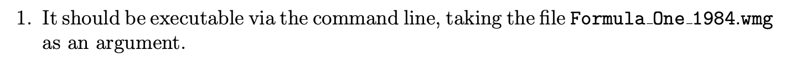
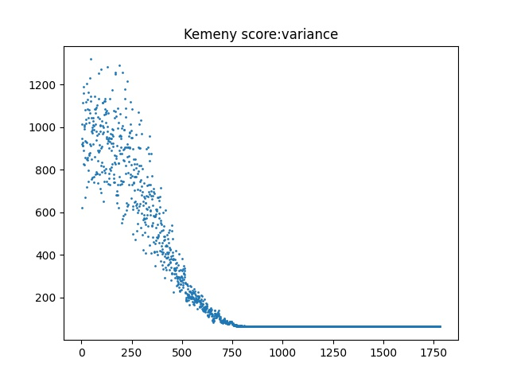
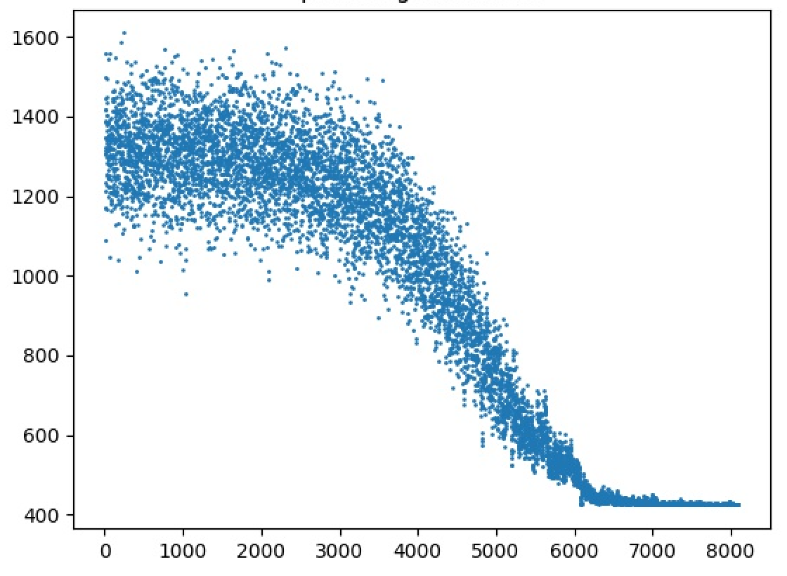

<center><font size="6">代码解释和说明</font></center>

## Run Code

- 请使用python3

- 安装matplotlib

  ```python
  pip3 install matplotlib
  ```

- 将数据和文件放在一起，进入文件所在的目录，执行：

  - 注：这个格式是作业要求的：

    

  ```python
  python3 SA_main.py data.wmg
  ```

   会得到控制台结果和图片。

## Code explanation

- my_random.py 伪随机数发生器

- SA_.py SA类文件

- SA_main.py 文件读取和主函数

  - 调参请只改动SA_main.py

- 输出示例：

  ```python
  Simulation start: ------------------------------------>!!
  result: 
  ========================================
  	rank		participant's name
  ----------------------------------------
  	  1 	|	 Alain Prost 
  	  2 	|	 Niki Lauda 
  	  3 	|	 Rene Arnoux 
  	  4 	|	 Elio de Angelis 
  	  5 	|	 Corrado Fabi 
  	  6 	|	 Derek Warwick 
  	  7 	|	 Michele Alboreto 
  	  8 	|	 Nelson Piquet 
  	  9 	|	 Patrick Tambay 
  	 10 	|	 Andrea de Cesaris 
  	 11 	|	 Mauro Baldi 
  	 12 	|	 Thierry Boutsen 
  	 13 	|	 Teo Fabi 
  	 14 	|	 Riccardo Patrese 
  	 15 	|	 Jo Gartner 
  	 16 	|	 Gerhard Berger 
  	 17 	|	 Nigel Mansell 
  	 18 	|	 Keke Rosberg 
  	 19 	|	 Ayrton Senna 
  	 20 	|	 Eddie Cheever 
  	 21 	|	 Marc Surer 
  	 22 	|	 Jonathan Palmer 
  	 23 	|	 Martin Brundle 
  	 24 	|	 Huub Rothengatter 
  	 25 	|	 Jacques Laffite 
  	 26 	|	 Stefan Bellof 
  	 27 	|	 Stefan Johansson 
  	 28 	|	 Piercarlo Ghinzani 
  	 29 	|	 Manfred Winkelhock 
  	 30 	|	 Johnny Cecotto 
  	 31 	|	 Philippe Streiff 
  	 32 	|	 Francois Hesnault 
  	 33 	|	 Philippe Alliot 
  	 34 	|	 Mike Thackwell 
  	 35 	|	 Pierluigi Martini 
  ========================================
  The Kemeny score of this best ranking is:  63
  run time:  17099.21884536743 ms
  ```

  

### my_randomig

```python
def LCG(n,x0):
    re = []
    re.append(x0)
    for i in range(1, n):
        re.append((314159269 * re[i - 1] + 453806245) % (2**31))
    for i in range(n):
         re[i] /= (2**31)
    return re
```

一个线性同余伪随机数发生器。

### SA_.py

- 这个是SA的类
- 一些SA算法相关的函数：
  - 邻域操作：get_one_neighbor_or_self()
  - 内层循环：inner_cyc()
  - 外层循环：SA_main()
  - 打印结果：dump_result()

### SA_main.py

- 这个是主文件，包括了文件读取、和调用参数生成SA对象。

## 如何调参

- SA_main.py

  ```python
  # SA parameters describe:
  # code length: number of participants in file '.wmg'
  # SA max inner step: 100 (control annealing)
  # SA max outer step: 10000 (control Temperature dropping)
  # SA inner convergence condition: 0(do not use), others, range: [1, max_inner_step]
  # SA outer convergence condition: 0(do not use), others, range: [1, max_outer_step]
  # (accelerating tech explain):
  # if max_step times of iteration remains the result, which means a convergence, then there is no need to go on.
  # SA initial Temperature: T0
  # SA Temperature Multiplier: T_k+1 = T_k * TMultiplier
  # So the TL = TMultiplier **(outer_step(really ran)) * T0
  
  #parameter list of the SA class:
  #clength, inner_step, outer_step, inner_stop, outer_stop, T0, TMultipiler
  data = load_file()
  
  #==============================changeable==============================
  question1 = sa.SA(data[0], 100, 5000, 0, 1000, 2000, 0.99)
  
  ```

  ​	参数说明在上面，其中data[0] 后面的参数是可以调节的，调节内外循环长度、初始温度和温度乘子，这些显著影响结果，调节内循环、外循环停止条件可以显著提高速度。

  - 请使用图片来辅助调参，一般如果最后结果明显没有收敛，说明外循环步长设置小了，或者温度乘子过大。但是温度乘子太小会使得解难以收敛到最优解。

    比如这个：最后的线都没变平

    

  - 如果太慢，可以改变内外循环的停止条件，（停止条件即，停止条件参数次，分数都没有变，那就可以认为是收敛了）

