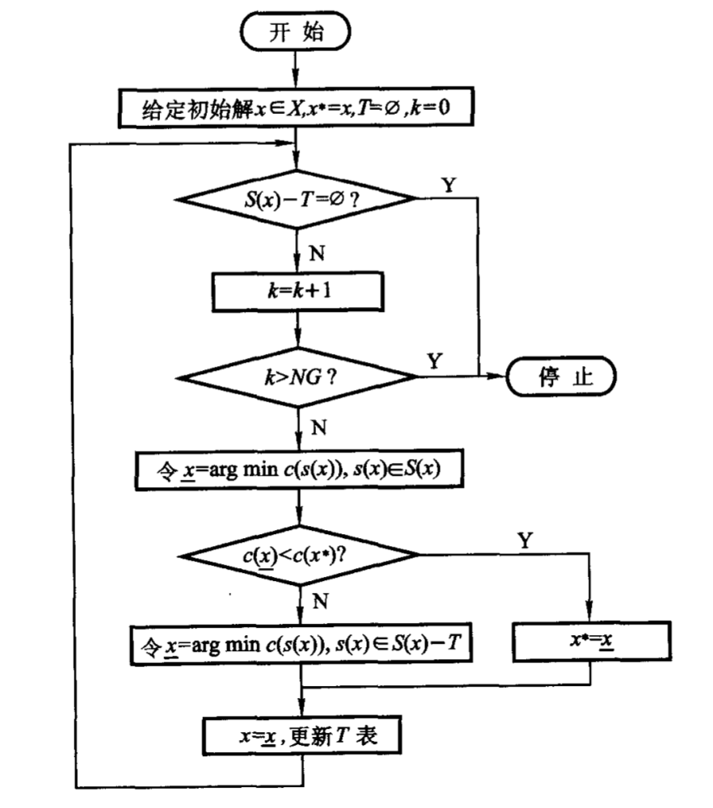

## 禁忌搜索

　### 局部邻域搜索

​	基于贪心思想，持续地在当前邻域中搜索，直至邻域中再也没有更好的解，称为爬山启发式算法。

​	考虑如下的优化问题：

​	$\min c(x):x\in X \sub \mathrm{R}^n$

​	解空间由$n$维实空间上的优先个离散点构成。邻域搜索就是从一个解移动到另外一个解，移动用$s$构成，移动后的解为$s(x)$，当前解所有移动全部的*一步可达解* 的集合$S(x)$，就是邻域。

**局部邻域搜索：**

1. 选择一个初始解$x\in X$

2. 在当前解的邻域中选择饿一个能得到的最好的解的移动$s$，$c(s(x))<c(x),s(x)\in S(x)$

   如果这样的移动不存在，则$x$就是局部最好解，算法停止

3. 令$x=s(x)$为当前解，转step2，继续搜索。

### 禁忌搜索算法的基本思想

​	基本思想就是在搜索过程中将近期历史上的搜索过程存放在禁忌表中，阻止算法重复进入，有效防止搜索过程的循环，模拟人的记忆功能。

​	思路如下：为了逃离局部最优解，算法必须能够接受劣解，每一次迭代得到的解不一定由于原来的解，这可能造成循环，为了避免循环，算法将最近接受的一些移动放在禁忌表中，在以后的迭代中加以禁止。若干步后，最早进入禁忌表的移动解禁。

### 算法的构成要素

- 编码方式（Encode）

- 适值函数

- 解的初始化

  针对随机解的不可行问题：可以针对特定的问题设计启发式方法寻找可行的初始解

- 移动（Moving）

- 邻域（Neighborhood）

- 禁忌表（Tabu List）

  - 禁忌对象

    1. 状态本身
    2. 状态分量或者状态分量的变化
    3. 目标值

  - 禁忌表长度

    受制于问题规模和邻域大小

  - 禁忌搜索中的中、长期表的使用

    ​	

- 选择策略（Selection Strategy）

- 渴望水平（Aspiration Level）

  在某些特定的条件下，不管某个移动是否在禁忌表中，都接受这个移动并更新当前解和历史最优解。这个移动满足的特定条件称为渴望水平，或称为破禁水平。

  渴望准则的设定规则：

  1. 基于适配值的准则，“Best so Far”

  2. 基于搜索方向的准则，如果某个禁忌对象计入禁忌表的时候改善了适配值，而这次这个被禁忌的候选解又改善了适配值，那么这个移动破禁。

     $c(s(x))<c(x) \wedge c(s(\underline{x}))<c(\underline{x})$

     其中$\underline{x}$为该对象上次被禁时的解

  3. 基于影响力的准则

- 停止准则（Stopping Rule）

  1. 最大迭代步数
  2. 得到满意解
  3. 设定某对象的最大禁忌频率

### 算法的步骤

### TS的短、中、长期表的使用

1. 短期表 - T表
   - 禁忌对象：T表中被禁忌的变化元素
   - 禁忌长素：T表的长度，禁忌对象的最大值
   - 变化因素：解的变化、解分量的变化、函数值的变化

**引入中长期表的目的：**

改变TS的广域搜索能力，TS的局域搜索能力很好，邻域选优快，广域搜索能力差，搜索能力是TS的关键，采用中长期表可改善TS的广域搜索能力。

1. 中期表：频数表

   频数表记录了不同方向的移动次数，从而加以惩罚，提高搜索方向的多样性

2. 长期表：记录多个初始解，从这些初始解开始**分别**进行禁忌搜索，即多阶段禁忌搜索

   长期表并不同于短期表和中期表，不基于过去搜索进行搜索，而是在新的区域完全随机生成初始解进行搜索，是“非学习式”的搜索策略

