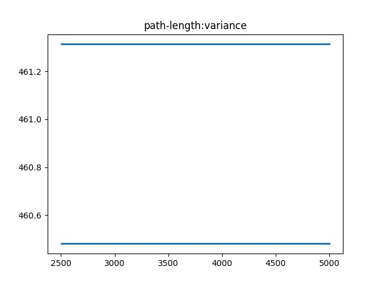
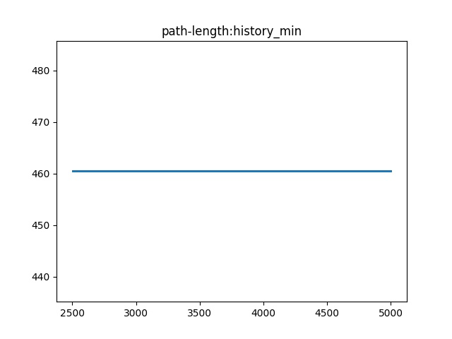
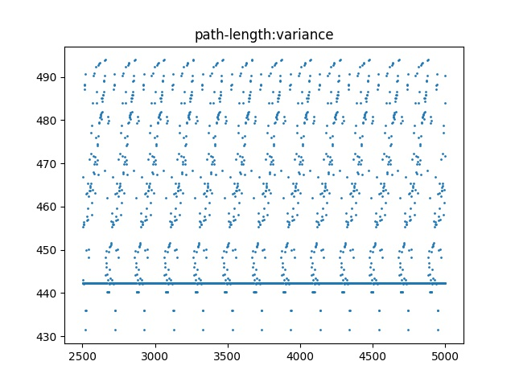
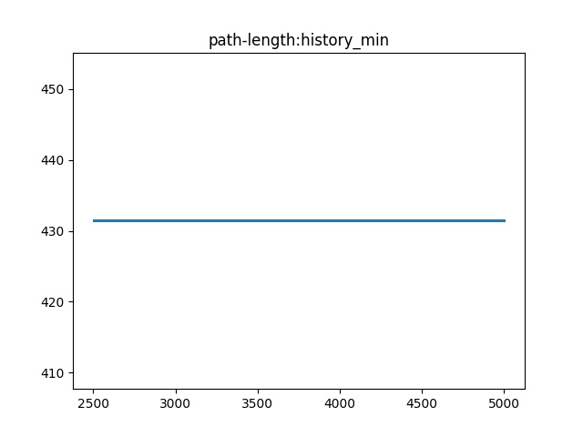
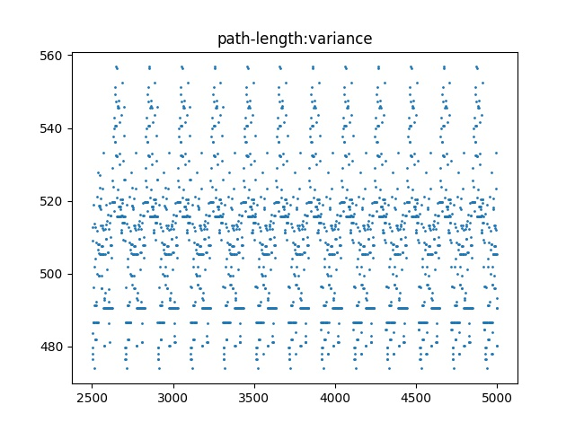
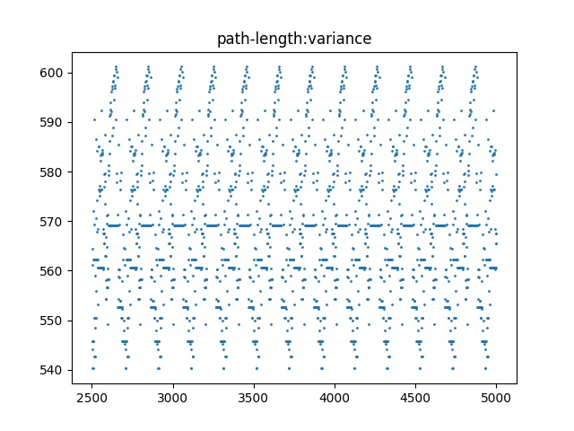
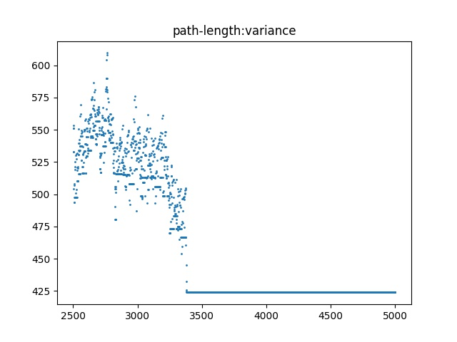
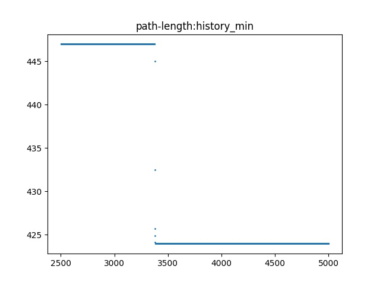

## 使用禁忌搜索算法尝试求解TSP NP完全问题

### TS问题代码框架

TS问题通过使用禁忌表避免搜索过程中的循环，并对于及优的解给予破禁，从而使得求解既可以快速收敛到最优解附近，也可以允许求解沿着一定的非最优方向行进，防止算法停滞在局部最优解处。

#### TS算法框架

- 算法的总框架

  相比于遗传算法，TS算法的框架比较小，同时也不需要保存巨量的历史解或者（GA一样的）并行群体解，因此运算速度较快

  算法TS类用到的参数：

  ```python
   				self.global_random_list_index = 1
          self.random_list_length = 2 ** 20
          self.random_list = []
          self.start_time = time.time()
          self.end_time = self.start_time
          self.file_path = '/Users/birdpeople/classObject/'
  
          self.statistics = []
          self.node_num = clength
          self.code = []
          self.fitness = 0
          self.result = []
          self.max = 1e5
          self.history_min = 1e5
          self.history_min_code = []
          self.step = step
          self.gap = gap
          self.will = will
          self.neighbors_score = [[]for i in range(self.node_num)]
          self.city =  \
                      [[1,    41, 94],
                       [2,    37, 84],
                       [3,    54, 67],
                       [4,    25, 62],
                       [5,    7,  64],
                       [6,    2,  99],
                       [7,    68, 58],
                       [8,    71, 44],
                       [9,    54, 62],
                       [10,   83, 69],
                       [11,   64, 60],
                       [12,   18, 54],
                       [13,   22, 60],
                       [14,   83, 46],
                       [15,   91, 38],
                       [16,   25, 38],
                       [17,   24, 42],
                       [18,   58, 69],
                       [19,   71, 71],
                       [20,   74, 78],
                       [21,   87, 76],
                       [22,   18, 40],
                       [23,   13, 40],
                       [24,   82, 7 ],
                       [25,   62, 32],
                       [26,   58, 35],
                       [27,   45, 21],
                       [28,   41, 26],
                       [29,   44, 35],
                       [30,   4,  50]]
          self.Weight = [[[] for i in range(self.node_num)] for j in range(self.node_num)]
          self.table_length = table_length
          self.TS_table = [[]for i in range(self.table_length)]
          self.table_rear_index = 0
          self.table_head_index = 0
          self.TS_map = [[0 for j in range(self.node_num+1)] for i in range(self.node_num+1)]
          self.TS_init()
  ```

  **算法框架：**

  首先**初始化：**

  - 生成初始编码
  - 计算权矩阵
  - 计算初始适应度

  ```python
      def TS_init(self):
          self.random_list_update()
          self.TS_table[0] = (0,0)
          self.TS_map[0][0] = 1
          a_code = self.get_code()
          self.code = a_code
  
          for i in range(self.node_num):
               for j in range(self.node_num):
                       self.Weight[i][j] = self.dist(i, j)
  
          edge = self.code2edge(self.code)
          self.history_min = self.fitness_function(edge)
          self.fitness = self.history_min
          self.history_min_code = a_code
  ```

  本问题使用了TSP路径编码

  - 基本主循环包括寻找邻居、更新编码、禁忌表、适应度函数，更新统计信息

  ```python
      def TS_main(self):
          print("start simulation: ", end='')
          if self.step != 0:
              for i in range(self.step):
                  self.progress_bar(i)  # this is progress bar
                  nei = self.find_neighbor_change()
                  self.update(nei)
                  self.update_statistic()
          print(">!!")
  ```

- 寻找邻居：

  在本问题中，使用**交叉两个位置**作为一次候选邻居操作，真实的邻居操作为——交换使得适应度函数的值最小，即——适应度函数改变的值最小。同时该邻居操作还不能在禁忌表中，除非满足破禁条件。

  本问题具有三个破禁条件：

  - 历史最优解更新
  - 渴望水平
  - 一阶破禁条件：邻居操作改变的值小于设定的gap值（通常为一个负数）

  ```python
  if self.fitness + score >= self.history_min \
                              and self.fitness + score >= self.will \
                              and score >= self.gap:
  ```

  则寻找邻居的函数为：

   ```python
       def W(self, i,j):
           return self.Weight[i-1][j-1]
   
       def cross_score_change(self, pos1, pos2):
           pos1_ = self.code[pos1]
           from1_ = self.code[(pos1-1)%(self.node_num)]
           to1_ = self.code[(pos1+1)%(self.node_num)]
   
           pos2_ = self.code[pos2]
           from2_ = self.code[(pos2 - 1) % (self.node_num)]
           to2_ = self.code[(pos2 + 1) % (self.node_num)]
   
           if to2_ == pos1_:
               res = -self.W(pos1_, to1_) - self.W(pos2_, from2_)\
                    + self.W(pos2_, to1_) + self.W(pos1_, from2_)
               return res
           if to1_ == pos2_:
               res = -self.W(pos1_,from1_ ) - self.W(pos2_, to2_)\
                   + self.W(pos2_,from1_) + self.W(pos1_, to2_)
               return res
           else:
               res = - self.W(pos1_,from1_) - self.W(pos1_, to1_)\
                 - self.W(pos2_,from2_) - self.W(pos2_, to2_)\
                 + self.W(pos1_,from2_) + self.W(pos1_, to2_)\
                 + self.W(pos2_,from1_) + self.W(pos2_, to1_)
           return res
   
       def find_neighbor_change(self):
           s_min = self.max
           s_add = (0,0,0,0)
           for i in range(self.node_num):
               for j in range(i):
                   s_in_TS = 0
                   score = self.cross_score_change(i, j)
                   if self.TS_map[self.code[j]][self.code[i]] == 1:
                       s_in_TS = 1
                       if self.fitness + score >= self.history_min \
                               and self.fitness + score >= self.will \
                               and score >= self.gap:
                           score = self.max
                   if score < s_min:
                       s_min = score
                       s_add = (i, j, s_in_TS, score)
           return s_add
   ```

  这里有一个编程小技巧就是使用了节点hash（TS_map）来加速判断是否在禁忌表中。从而真正的禁忌表**不会被用于查找，只会用于两个作用**：

  1. 表长限制，当表满的时候，队头元素出队列

     （我们把list加两个头尾指针来当作定长的循环队列用，真的在适合不过了，真庆幸我数据结构还算扎实……）

  2. 记录出入队列的元素，从而得以更新hash表（TS_map）

- 更新禁忌表：

  ```python
  def TS_map_triger(self, content):
      self.TS_map[content[0]][content[1]] = int(not(bool(self.TS_map[content[0]][content[1]])))
  
  def update(self, neighbors):
      tmp = self.code[neighbors[0]]
      self.code[neighbors[0]] = self.code[neighbors[1]]
      self.code[neighbors[1]] = tmp
      if neighbors[2] == 0: #not break up
          h = self.table_head_index
          h_back = (h+1)%self.table_length
          r_back = (self.table_rear_index + 1) % self.table_length
          if r_back == h:#full TS_table:
              self.TS_map_triger(self.TS_table[h])
              self.table_head_index = h_back
  
          self.TS_table[r_back] = (self.code[neighbors[0]], self.code[neighbors[1]])
          self.table_rear_index = r_back
          self.TS_map_triger(self.TS_table[r_back])
      self.fitness += neighbors[3]
  
      if self.history_min > self.fitness:
          self.history_min = self.fitness
          self.history_min_code = self.code
  ```

  ​	在更新操作中，我们将从上面邻域选取与寻找最优邻居操作的函数find_neighbor_change函数中确定了需要交换的位置、分数变化，是否破禁，从而可以在更新的函数update中更新它。

- 更新统计信息：

  ```python
      def update_statistic(self):
          res = []
          res.append(self.code)
          res.append(self.fitness)
          res.append(self.history_min)
          res.append(self.history_min_code)
          self.statistics.append(res)
  
  ```

  

### 结果与分析

#### 调参过程分析：

在经过一系列失败的调参后，观察图片，得到一系列小结论，指导了调参过程。

（由于在前面的很大迭代步中，算法快速收敛导致后面精确局部极小搜索难以观察，因此后面的图片仅仅展示一半迭代步到完成的收敛过程，此时可以观察到比较细致的收敛过程）

#### 参数设置：

- TSP问题规模，本问题为30
- 迭代步：本问题设置为5000
- TS表最大长度，需要调参
- TS表一阶破禁条件：需要调参
  - 一阶破禁条件在此处被定义为：如果邻居（一次交换）带来了优于该水平的适值函数优化（此问题为减小值），那么可以得知，该次交换
- TS渴望水平：需要调参（问题最优解为423附近）
  - 渴望水平在此处定义为邻居一步操作使得该问题的解（本问题为路径长）达到了该水平，则给予破禁，使得其回归为渴望水平
- （隐藏的无参破禁条件：邻居的一步操作使得解的水平为历史最优解）

综上用TS表示禁忌搜索问题的函数入口，参数显示表达如下：

```python
# parameters describe:
# code length: 30
# max step: 5000
# TS table length:
# TS break up gap: (being negative)
# TS break up will level: (being close to solution)

qusetion1 = TS(clength, step, table_length, gap, will)
```


#### 一系列初始观察：

1. ```python
   参数：
   TS(30, 5000, 200, -30, 500)
   控制台：
   result: f([(4, 13), (13, 12), (12, 30), (30, 23), (23, 22), (22, 17), (17, 16), (16, 29), (29, 26), (26, 25), (25, 28), (28, 27), (27, 24), (24, 15), (15, 14), (14, 10), (10, 21), (21, 20), (20, 19), (19, 18), (18, 3), (3, 11), (11, 7), (7, 8), (8, 9), (9, 2), (2, 1), (1, 6), (6, 5), (5, 4)] ) =  460.4807428635999
   run time:  6.342038869857788 s
   ```





**分析：**该结果表明，邻居操作循环周期非常小，应为2。这意味着，由于渴望水平达成难度很低，从而使得局部解收敛后一致位于渴望水平之内，从而算法一直处于破禁的状态。

**策略：**提高渴望水平的达成上限（在此问题为降低其值）


2. ```python
   参数：
   TS(30, 5000, 200, -30, 425)
   控制台：
   result: f([(10, 21), (21, 20), (20, 19), (19, 3), (3, 9), (9, 11), (11, 7), (7, 8), (8, 14), (14, 15), (15, 24), (24, 25), (25, 26), (26, 27), (27, 28), (28, 29), (29, 16), (16, 17), (17, 22), (22, 23), (23, 30), (30, 4), (4, 13), (13, 12), (12, 5), (5, 6), (6, 1), (1, 2), (2, 18), (18, 10)] ) =  431.4379684789724
   run time:  6.475661754608154 s
   ```





**分析：**该结果表明，邻居操作循环具有周期，从图中的结果分析，渴望水平没有发挥作用。但是。这意味着，搜索的循环应该是因为算法在爬山到一定程度后，到达了快速断崖式回落的位置，从而使得邻居操作满足一阶破禁条件。

**策略：**提高一阶破禁条件的绝对值


3. 一阶破禁条件决定了解循环“震荡”的纵向（适值函数值域）区间：

   当破禁条件过于苛刻的时候，它仍然是可以满足的（从图上看，解循环震荡的值域范围变大了）。这意味着：较苛刻的破禁条件可以为解空间提供更大的多样性，同时禁忌表长度在此处呈现耦合效应，当循环周期增长的时候，禁忌表大小也应增长，来满足解空间的多样性。

   ```python
   参数：
   TS(30, 5000, 200, -100, 424)
   控制台：
   result: f([(10, 21), (21, 11), (11, 7), (7, 14), (14, 15), (15, 24), (24, 8), (8, 25), (25, 26), (26, 27), (27, 29), (29, 28), (28, 16), (16, 23), (23, 17), (17, 22), (22, 12), (12, 30), (30, 13), (13, 4), (4, 5), (5, 6), (6, 2), (2, 1), (1, 18), (18, 9), (9, 3), (3, 19), (19, 20), (20, 10)] ) =  439.5776299207787
   run time:  6.34497594833374 s
   
   ```



4. 过于苛刻的破禁条件：

   过于苛刻的破禁条件使得搜索具有变得异常平庸的风险，因为在初始迭代迅速收敛的过程，也可能使得因为达不到破禁水平而错失收敛到全局最优解的附近的机会：

   例如：

   ```python
   参数：
   TS(30, 5000, 200, -100, 423.8)
   控制台：
   result: f([(21, 10), (10, 18), (18, 1), (1, 2), (2, 6), (6, 30), (30, 23), (23, 22), (22, 16), (16, 29), (29, 11), (11, 19), (19, 9), (9, 7), (7, 8), (8, 14), (14, 15), (15, 24), (24, 25), (25, 26), (26, 27), (27, 28), (28, 17), (17, 5), (5, 13), (13, 12), (12, 4), (4, 3), (3, 20), (20, 21)] ) =  519.1019780589377
   run time:  6.409013032913208 s
   ```



​	综合以上的结论，初始点的选择和优秀的参数对于TS求解该问题真的具有同等重要额意义！

**优秀结果：**

```python
参数：
TS(30, 5000, 200, -100, 425)
控制台：
result: f([(29, 26), (26, 25), (25, 24), (24, 15), (15, 14), (14, 8), (8, 7), (7, 11), (11, 10), (10, 21), (21, 20), (20, 19), (19, 18), (18, 9), (9, 3), (3, 2), (2, 1), (1, 6), (6, 5), (5, 4), (4, 13), (13, 12), (12, 30), (30, 23), (23, 22), (22, 17), (17, 16), (16, 28), (28, 27), (27, 29)] ) =  423.9490417641024
run time:  6.177871942520142 s
```

图片：



